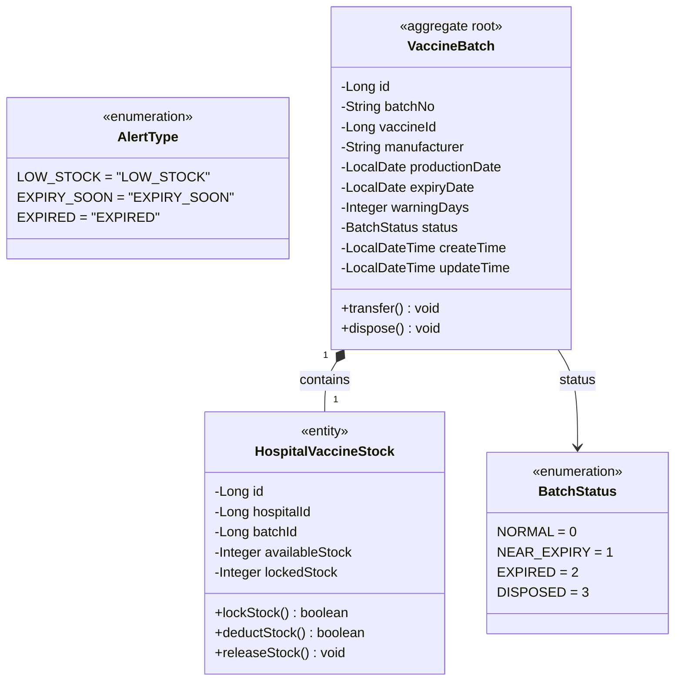
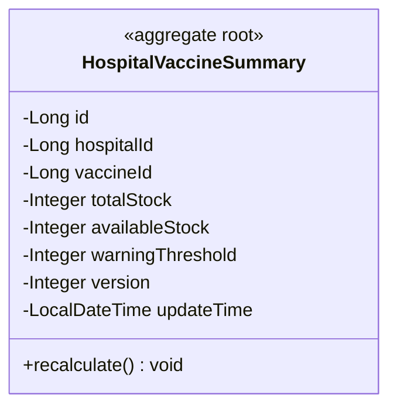

# 疫苗管理系统 — 库存上下文领域模型

**文档编号:** DOMAIN-STOCK-001
**版本:** V1.1
**状态:** 正式发布
**日期:** 2026-04-02
**上游依赖:** REQ-STOCK V1.0 / REQ-GLOBAL V1.0

---

## 目录

1. [上下文概述](#1-上下文概述)
2. [聚合设计](#2-聚合设计)
3. [实体详细定义](#3-实体详细定义)
4. [值对象定义](#4-值对象定义)
5. [领域服务](#5-领域服务)
6. [领域事件](#6-领域事件)
7. [仓储接口](#7-仓储接口)
8. [物理数据模型](#8-物理数据模型)
9. [与其他上下文的关系](#9-与其他上下文的关系)

---

## 1. 上下文概述

### 1.1 核心定位

Stock Context 是系统的**库存资源层**。负责疫苗批次生命周期管理、库存查询、内部调拨、批次销毁、库存预警。

### 1.2 职责边界

| 职责 | 本上下文 | 其他上下文 |
|------|---------|-----------|
| 批次管理 | **负责** | — |
| 库存查询 | **负责** | — |
| 库存调拨 | **负责** | — |
| 批次销毁 | **负责** | — |
| 库存预警 | **负责** | — |
| 库存锁定（登记时） | 提供接口 | Register Context 调用 |
| 库存扣减（接种时） | 提供接口 | Vaccinate Context 调用 |
| 库存释放（取消时） | 提供接口 | Appointment Context 调用 |

### 1.3 库存双字段模型

```
┌─────────────────────────────────┐
│       total_stock               │
│  ┌─────────────┐ ┌───────────┐ │
│  │ available   │ │  locked   │ │
│  │   _stock    │ │  _stock   │ │
│  │  (可预约)   │ │ (已登记)  │ │
│  └─────────────┘ └───────────┘ │
└─────────────────────────────────┘
```

---

## 2. 聚合设计

### 2.1 聚合 1：VaccineBatch（疫苗批次）



### 2.2 聚合 2：HospitalVaccineSummary（库存汇总）



### 2.3 非聚合根实体

| 实体 | 说明 | 所属聚合 |
|------|------|---------|
| `StockTransferLog` | 库存调拨日志 | 无（独立实体） |
| `BatchDisposeLog` | 批次销毁日志 | 无（独立实体） |
| `StockAlertLog` | 库存预警日志 | 无（独立实体） |

---

## 3. 实体详细定义

### 3.1 VaccineBatch（疫苗批次）

| 字段 | 类型 | 约束 | 说明 |
|------|------|------|------|
| id | bigint | PK, auto_increment | 批次ID |
| batch_no | varchar(50) | UNIQUE, NOT NULL | 批次号 |
| vaccine_id | bigint | NOT NULL, FK → vaccine.id | 疫苗ID |
| manufacturer | varchar(100) | NULL | 生产厂家 |
| production_date | date | NULL | 生产日期 |
| expiry_date | date | NOT NULL | 有效期 |
| warning_days | int | DEFAULT 30 | 临期预警天数 |
| status | tinyint | NOT NULL, DEFAULT 0 | 状态（0正常/1临期/2过期/3已销毁） |
| create_time | datetime | NOT NULL, DEFAULT CURRENT_TIMESTAMP | 创建时间 |
| update_time | datetime | NOT NULL, DEFAULT CURRENT_TIMESTAMP ON UPDATE | 更新时间 |

### 3.2 HospitalVaccineStock（医院库存）

| 字段 | 类型 | 约束 | 说明 |
|------|------|------|------|
| id | bigint | PK, auto_increment | 库存ID |
| hospital_id | bigint | NOT NULL | 医院ID |
| batch_id | bigint | NOT NULL, FK → vaccine_batch.id | 批次ID |
| available_stock | int | NOT NULL, DEFAULT 0 | 可用库存 |
| locked_stock | int | NOT NULL, DEFAULT 0 | 锁定库存 |

**唯一约束：** UNIQUE(hospital_id, batch_id)

### 3.3 HospitalVaccineSummary（库存汇总）

| 字段 | 类型 | 约束 | 说明 |
|------|------|------|------|
| id | bigint | PK, auto_increment | 汇总ID |
| hospital_id | bigint | NOT NULL | 医院ID |
| vaccine_id | bigint | NOT NULL, FK → vaccine.id | 疫苗ID |
| total_stock | int | NOT NULL, DEFAULT 0 | 总库存 |
| available_stock | int | NOT NULL, DEFAULT 0 | 可用库存 |
| warning_threshold | int | NOT NULL, DEFAULT 20 | 预警阈值（百分比） |
| version | int | NOT NULL, DEFAULT 0 | 乐观锁版本号 |
| update_time | datetime | NOT NULL | 更新时间 |

### 3.4 StockTransferLog（调拨日志）

| 字段 | 类型 | 约束 | 说明 |
|------|------|------|------|
| id | bigint | PK | 日志ID |
| transfer_no | varchar(30) | UNIQUE | 调拨单号（TF+YYYYMMDD+4seq） |
| batch_id | bigint | NOT NULL | 批次ID |
| from_type | tinyint | NOT NULL | 调出类型（0总仓/1接种点） |
| from_id | bigint | NOT NULL | 调出位置ID |
| to_type | tinyint | NOT NULL | 调入类型 |
| to_id | bigint | NOT NULL | 调入位置ID |
| quantity | int | NOT NULL | 调拨数量 |
| operator_id | bigint | NOT NULL | 操作员ID |
| transfer_time | datetime | NOT NULL | 调拨执行时间 |
| remark | varchar(500) | NULL | 调拨备注 |
| create_time | datetime | NOT NULL | 创建时间 |

### 3.5 BatchDisposeLog（销毁日志）

| 字段 | 类型 | 约束 | 说明 |
|------|------|------|------|
| id | bigint | PK | 日志ID |
| dispose_no | varchar(30) | UNIQUE | 销毁单号（BD+YYYYMMDD+4seq） |
| batch_id | bigint | NOT NULL | 批次ID |
| dispose_quantity | int | NOT NULL | 销毁数量 |
| dispose_reason | varchar(500) | NOT NULL | 销毁原因 |
| operator_id | bigint | NOT NULL | 操作员ID |
| dispose_time | datetime | NOT NULL | 销毁执行时间 |
| remark | varchar(500) | NULL | 销毁备注 |
| create_time | datetime | NOT NULL | 创建时间 |

### 3.6 StockAlertLog（预警日志）

| 字段 | 类型 | 约束 | 说明 |
|------|------|------|------|
| id | bigint | PK | 预警ID |
| alert_type | varchar(20) | NOT NULL | 预警类型（LOW_STOCK/EXPIRY_SOON/EXPIRED） |
| vaccine_id | bigint | NULL | 疫苗ID |
| batch_id | bigint | NULL | 批次ID |
| alert_value | decimal(10,2) | NULL | 预警值 |
| expiry_date | date | NULL | 有效期 |
| is_handled | tinyint | DEFAULT 0 | 是否已处理 |
| create_time | datetime | NOT NULL | 创建时间 |

---

## 4. 值对象定义

| 值对象 | 枚举值 | 说明 |
|--------|--------|------|
| BatchStatus | NORMAL(0), NEAR_EXPIRY(1), EXPIRED(2), DISPOSED(3) | 批次状态 |
| AlertType | LOW_STOCK, EXPIRY_SOON, EXPIRED | 预警类型 |
| LocationType | WAREHOUSE(0), VACCINATION_POINT(1) | 库存位置类型 |

### 批次状态流转

```
NORMAL(0) → NEAR_EXPIRY(1) → EXPIRED(2) → DISPOSED(3)
                                              ↑
NORMAL(0) ─────────────────────────────────────┘
NEAR_EXPIRY(1) ───────────────────────────────┘
EXPIRED(2) ──────────────────────────────────┘
```

---

## 5. 领域服务

### 5.1 StockService

#### 5.0 VaccineCatalogService — 疫苗目录管理

| 方法 | 说明 | 权限 |
|------|------|------|
| getVaccineList(keyword, type, page) | 疫苗列表（分页+搜索） | vaccine.catalog.view |
| getVaccineDetail(vaccineId) | 疫苗详情 | vaccine.catalog.view |
| createVaccine(data) | 新增疫苗 | vaccine.catalog.manage |
| updateVaccine(vaccineId, data) | 修改疫苗 | vaccine.catalog.manage |
| updateShelfStatus(vaccineId, onShelf) | 上架/下架 | vaccine.catalog.manage |

**上架/下架规则：**
- 下架时检查是否存在进行中预约（status IN (1,6,7,8,10)）引用该疫苗，有则拒绝
- 上架无额外限制

#### 5.1.1 lockStock — 锁定库存（供 Register ACL 调用）

```java
/**
 * 登记时锁定库存
 * 不变式：locked_stock < available_stock（锁定后 locked 仍不超过 available）
 */
public boolean lockStock(Long batchId) {
    int affected = stockRepository.lockStock(batchId);
    return affected > 0;
}
```

```sql
UPDATE hospital_vaccine_stock
SET locked_stock = locked_stock + 1
WHERE batch_id = #{batchId} AND locked_stock < available_stock;
```

#### 5.1.2 deductStock — 扣减库存（供 Vaccinate ACL 调用）

```java
/**
 * 接种时扣减库存
 * 不变式：available_stock >= 1 AND locked_stock >= 1
 */
public boolean deductStock(Long batchId) {
    int affected = stockRepository.deductStock(batchId);
    return affected > 0;
}
```

```sql
UPDATE hospital_vaccine_stock
SET available_stock = available_stock - 1,
    locked_stock = locked_stock - 1
WHERE batch_id = #{batchId}
  AND available_stock >= 1
  AND locked_stock >= 1;
```

#### 5.1.3 releaseStock — 释放库存

```sql
UPDATE hospital_vaccine_stock
SET locked_stock = locked_stock - 1
WHERE batch_id = #{batchId} AND locked_stock > 0;
```

#### 5.1.4 transferStock — 库存调拨（事务 T8）

```java
/**
 * 库存调拨 — 事务 T8
 *
 * 死锁预防：库存内部事务按 vaccine_batch → hospital_vaccine_stock 顺序加锁
 */
@Transactional(rollbackFor = Exception.class, timeout = 30)
public TransferResult transferStock(Long batchId, int quantity,
                                     int fromType, Long fromId,
                                     int toType, Long toId,
                                     Long operatorId) {
    // 1. 校验同位置
    if (fromType == toType && fromId.equals(toId)) {
        throw new BusinessException(4001, "调拨位置相同");
    }

    // 2. 锁定批次（固定顺序第一步）
    VaccineBatch batch = batchRepository.findByIdForUpdate(batchId);
    if (batch.getStatus() == BatchStatus.DISPOSED.getCode()) {
        throw new BusinessException(4003, "批次已销毁");
    }

    // 3. 锁定源库存
    VaccineStock source = stockRepository.findByLocationForUpdate(fromType, fromId, batchId);
    if (source.getAvailableStock() < quantity) {
        throw new BusinessException(4002, "调出位置库存不足");
    }

    // 4. 扣减源（Repository 实现需包含 WHERE available_stock >= #{quantity} 守卫）
    source.setAvailableStock(source.getAvailableStock() - quantity);
    stockRepository.updateStock(source);

    // 5. 增加目标
    stockRepository.addStock(toType, toId, batchId, quantity);

    // 6. 记录日志
    StockTransferLog log = new StockTransferLog();
    log.setTransferNo(generateTransferNo());
    log.setBatchId(batchId);
    log.setFromType(fromType);
    log.setFromId(fromId);
    log.setToType(toType);
    log.setToId(toId);
    log.setQuantity(quantity);
    log.setOperatorId(operatorId);
    transferLogRepository.save(log);

    // 7. 更新汇总（乐观锁）
    updateSummary(batch.getVaccineId());

    eventBus.publish(new StockTransferredEvent(batchId, quantity, fromType, fromId, toType, toId));
    return new TransferResult(log.getTransferNo());
}
```

#### 5.1.5 disposeBatch — 批次销毁（事务 T9）

```java
/**
 * 批次销毁 — 事务 T9
 */
@Transactional(rollbackFor = Exception.class, timeout = 30)
public DisposeResult disposeBatch(Long batchId, int quantity,
                                   String reason, Long operatorId) {
    if (reason == null || reason.isBlank()) {
        throw new BusinessException(4005, "销毁原因未填写");
    }

    // 1. 锁定批次
    VaccineBatch batch = batchRepository.findByIdForUpdate(batchId);
    if (batch.getStatus() == BatchStatus.DISPOSED.getCode()) {
        throw new BusinessException(4003, "批次已销毁");
    }

    // 2. 锁定库存
    VaccineStock stock = stockRepository.findByBatchIdForUpdate(batchId);
    if (stock.getAvailableStock() < quantity) {
        throw new BusinessException(4004, "销毁数量超过总库存");
    }

    // 3. 更新批次状态
    batch.setStatus(BatchStatus.DISPOSED.getCode());
    batchRepository.updateStatus(batch);

    // 4. 扣减库存
    // 注意：如果该批次存在已登记但未接种的记录（locked_stock > 0），
    // 销毁操作会将 locked_stock 置零。系统应在销毁前检查是否存在进行中预约
    // 引用该批次，如存在则拒绝销毁操作。
    int discardedLocked = stock.getLockedStock();
    if (discardedLocked > 0) {
        throw new BusinessException(4003, "该批次存在 " + discardedLocked + " 条已登记未接种记录，请先处理后再销毁");
    }
    stock.setAvailableStock(stock.getAvailableStock() - quantity);
    stockRepository.updateStock(stock);

    // 5. 记录日志
    BatchDisposeLog log = new BatchDisposeLog();
    log.setDisposeNo(generateDisposeNo());
    log.setBatchId(batchId);
    log.setDisposeQuantity(quantity);
    log.setDisposeReason(reason);
    log.setOperatorId(operatorId);
    disposeLogRepository.save(log);

    // 6. 更新汇总
    updateSummary(batch.getVaccineId());

    eventBus.publish(new BatchDisposedEvent(batchId, quantity, reason));
    return new DisposeResult(log.getDisposeNo());
}
```

#### 5.1.6 scanExpiry / scanAlerts — 定时任务

```java
/**
 * 过期扫描（每小时执行）
 * NEAR_EXPIRY: expiry_date - warning_days < NOW() AND status IN (0,1)
 * EXPIRED: expiry_date < NOW() AND status IN (0,1,2)
 */
@Transactional(rollbackFor = Exception.class, timeout = 60)
public int scanExpiry() {
    // 标记临期
    int nearExpiry = batchRepository.markNearExpiry();
    // 标记过期
    int expired = batchRepository.markExpired();
    return nearExpiry + expired;
}

/**
 * 库存预警扫描（每小时执行）
 * LOW_STOCK: available_stock / (available_stock + locked_stock) < threshold%
 */
public int scanAlerts() {
    // 查询所有可用批次，计算剩余率
    List<VaccineStock> stocks = stockRepository.findAllAvailable();
    int alertCount = 0;
    int threshold = configService.getInt("stock.low_threshold_percent", 20);

    for (VaccineStock stock : stocks) {
        int total = stock.getAvailableStock() + stock.getLockedStock();
        if (total > 0) {
            int remaining = (stock.getAvailableStock() * 100) / total;
            if (remaining < threshold) {
                // 幂等检查：同一批次仅保留一条未处理的 LOW_STOCK 预警
                boolean existsUnhandled = alertLogRepository
                    .existsUnhandledByBatchIdAndType(stock.getBatchId(), "LOW_STOCK");
                if (!existsUnhandled) {
                    StockAlertLog alert = new StockAlertLog();
                    alert.setAlertType("LOW_STOCK");
                    alert.setBatchId(stock.getBatchId());
                    alert.setAlertValue(new BigDecimal(remaining));
                    alertLogRepository.save(alert);
                    alertCount++;
                }
            }
        }
    }
    return alertCount;
}
```

#### 5.1.7 recalculateSummary — 库存汇总补偿更新

```java
/**
 * 库存汇总补偿更新（每5分钟执行）
 * 全量重算 hospital_vaccine_summary 的 total_stock 和 available_stock
 */
@Transactional(rollbackFor = Exception.class, timeout = 60)
public void recalculateSummary() {
    List<HospitalVaccineSummary> allSummaries = summaryRepository.findAll();
    for (HospitalVaccineSummary summary : allSummaries) {
        int totalStock = stockRepository.sumTotalByVaccine(summary.getVaccineId());
        int availableStock = stockRepository.sumAvailableByVaccine(summary.getVaccineId());
        summary.setTotalStock(totalStock);
        summary.setAvailableStock(availableStock);
        summaryRepository.updateWithOptimisticLock(summary);
    }
}
```

#### 5.1.8 updateSummary — 汇总更新（乐观锁）

```java
private void updateSummary(Long vaccineId) {
    // 汇总所有批次的库存
    int totalStock = stockRepository.sumTotalByVaccine(vaccineId);
    int availableStock = stockRepository.sumAvailableByVaccine(vaccineId);

    // 乐观锁更新
    HospitalVaccineSummary summary = summaryRepository.findByVaccineId(vaccineId);
    summary.setTotalStock(totalStock);
    summary.setAvailableStock(availableStock);
    summaryRepository.updateWithOptimisticLock(summary);
}
```

```sql
UPDATE hospital_vaccine_summary
SET total_stock = #{totalStock},
    available_stock = #{availableStock},
    version = version + 1,
    update_time = NOW()
WHERE id = #{id} AND version = #{version};
```

---

## 6. 领域事件

| 事件名 | 触发时机 | 携带数据 |
|--------|---------|---------|
| `StockTransferredEvent` | 库存调拨 | batchId, quantity, fromType, fromId, toType, toId |
| `BatchDisposedEvent` | 批次销毁 | batchId, quantity, reason |
| `StockAlertTriggeredEvent` | 库存预警 | vaccineId, batchId, alertType, alertValue |
| `BatchStatusChangedEvent` | 批次状态变更 | batchId, oldStatus, newStatus |

---

## 7. 仓储接口

```java
public interface VaccineBatchRepository {
    VaccineBatch findById(Long id);
    VaccineBatch findByIdForUpdate(Long id);
    VaccineBatch findAvailableForFEFO(Long vaccineId, Long hospitalId);
    List<VaccineBatch> findAvailableBatches(Long vaccineId);
    void save(VaccineBatch batch);
    void updateStatus(VaccineBatch batch);
    int markNearExpiry();
    int markExpired();
}

public interface VaccineStockRepository {
    VaccineStock findByBatchId(Long batchId);
    VaccineStock findByBatchIdForUpdate(Long batchId);
    VaccineStock findByLocationForUpdate(int type, Long locationId, Long batchId);
    boolean lockStock(Long batchId);
    int deductStock(Long batchId);
    void releaseStock(Long batchId);
    void updateStock(VaccineStock stock);
    void addStock(int type, Long locationId, Long batchId, int quantity);
    List<VaccineStock> findAllAvailable();
    int sumTotalByVaccine(Long vaccineId);
    int sumAvailableByVaccine(Long vaccineId);
}

public interface HospitalVaccineSummaryRepository {
    HospitalVaccineSummary findByVaccineId(Long vaccineId);
    void updateWithOptimisticLock(HospitalVaccineSummary summary);
}

public interface StockAlertLogRepository {
    void save(StockAlertLog alert);
    boolean existsUnhandledByBatchIdAndType(Long batchId, String alertType);
    List<StockAlertLog> findUnhandled();
    void markHandled(Long alertId);
}
```

---

## 8. 物理数据模型

### 8.1 DDL

```sql
-- ============================================================
-- 疫苗信息表（疫苗目录）
-- 所属上下文: Stock Context（疫苗基础数据）
-- ============================================================
CREATE TABLE `vaccine` (
    `id`              BIGINT       NOT NULL AUTO_INCREMENT COMMENT '疫苗ID',
    `vaccine_name`    VARCHAR(100) NOT NULL                COMMENT '疫苗名称',
    `vaccine_type`    VARCHAR(50)  NOT NULL                COMMENT '疫苗类型（CLASS_I一类/CLASS_II二类）',
    `manufacturer`    VARCHAR(100) NULL                    COMMENT '生产厂家',
    `description`    TEXT         NULL                    COMMENT '疫苗说明',
    `is_on_shelf`     TINYINT      NOT NULL DEFAULT 1      COMMENT '是否上架（0下架/1上架）',
    `create_time`    DATETIME     NOT NULL DEFAULT CURRENT_TIMESTAMP COMMENT '创建时间',
    `update_time`    DATETIME     NOT NULL DEFAULT CURRENT_TIMESTAMP ON UPDATE CURRENT_TIMESTAMP COMMENT '更新时间',
    PRIMARY KEY (`id`),
    KEY `idx_vaccine_type` (`vaccine_type`),
    KEY `idx_is_on_shelf` (`is_on_shelf`)
) ENGINE=InnoDB DEFAULT CHARSET=utf8mb4 COLLATE=utf8mb4_general_ci COMMENT='疫苗信息表';

-- ============================================================
-- 疫苗批次表
-- 所属上下文: Stock Context
-- ============================================================
CREATE TABLE `vaccine_batch` (
    `id`              BIGINT       NOT NULL AUTO_INCREMENT COMMENT '批次ID',
    `batch_no`        VARCHAR(50)  NOT NULL                COMMENT '批次号（唯一）',
    `vaccine_id`      BIGINT       NOT NULL                COMMENT '疫苗ID',
    `manufacturer`    VARCHAR(100) NULL                    COMMENT '生产厂家',
    `production_date` DATE         NULL                    COMMENT '生产日期',
    `expiry_date`     DATE         NOT NULL                COMMENT '有效期',
    `warning_days`    INT          NOT NULL DEFAULT 30     COMMENT '临期预警天数',
    `status`          TINYINT      NOT NULL DEFAULT 0      COMMENT '状态（0正常/1临期/2过期/3已销毁）',
    `create_time`     DATETIME     NOT NULL DEFAULT CURRENT_TIMESTAMP COMMENT '创建时间',
    `update_time`     DATETIME     NOT NULL DEFAULT CURRENT_TIMESTAMP ON UPDATE CURRENT_TIMESTAMP COMMENT '更新时间',
    PRIMARY KEY (`id`),
    UNIQUE KEY `uk_batch_no` (`batch_no`),
    KEY `idx_vaccine_id` (`vaccine_id`),
    KEY `idx_expiry_date` (`expiry_date`),
    KEY `idx_status` (`status`)
) ENGINE=InnoDB DEFAULT CHARSET=utf8mb4 COLLATE=utf8mb4_general_ci COMMENT='疫苗批次表';

-- ============================================================
-- 医院库存表（按批次）
-- 所属上下文: Stock Context
-- ============================================================
CREATE TABLE `hospital_vaccine_stock` (
    `id`               BIGINT   NOT NULL AUTO_INCREMENT COMMENT '库存ID',
    `hospital_id`      BIGINT   NOT NULL                COMMENT '医院ID',
    `batch_id`         BIGINT   NOT NULL                COMMENT '批次ID',
    `available_stock`  INT      NOT NULL DEFAULT 0      COMMENT '可用库存',
    `locked_stock`     INT      NOT NULL DEFAULT 0      COMMENT '锁定库存',
    PRIMARY KEY (`id`),
    UNIQUE KEY `uk_hospital_batch` (`hospital_id`, `batch_id`),
    KEY `idx_hospital_id` (`hospital_id`),
    KEY `idx_batch_id` (`batch_id`)
) ENGINE=InnoDB DEFAULT CHARSET=utf8mb4 COLLATE=utf8mb4_general_ci COMMENT='医院库存表';

-- ============================================================
-- 医院疫苗库存汇总表
-- 所属上下文: Stock Context
-- ============================================================
CREATE TABLE `hospital_vaccine_summary` (
    `id`                 BIGINT   NOT NULL AUTO_INCREMENT COMMENT '汇总ID',
    `hospital_id`        BIGINT   NOT NULL                COMMENT '医院ID',
    `vaccine_id`         BIGINT   NOT NULL                COMMENT '疫苗ID',
    `total_stock`        INT      NOT NULL DEFAULT 0      COMMENT '总库存',
    `available_stock`    INT      NOT NULL DEFAULT 0      COMMENT '可用库存',
    `warning_threshold`  INT      NOT NULL DEFAULT 20     COMMENT '预警阈值（百分比）',
    `version`            INT      NOT NULL DEFAULT 0      COMMENT '乐观锁版本号',
    `update_time`        DATETIME NOT NULL                COMMENT '更新时间',
    PRIMARY KEY (`id`),
    UNIQUE KEY `uk_hospital_vaccine` (`hospital_id`, `vaccine_id`),
    KEY `idx_vaccine_id` (`vaccine_id`)
) ENGINE=InnoDB DEFAULT CHARSET=utf8mb4 COLLATE=utf8mb4_general_ci COMMENT='医院疫苗库存汇总表';

-- ============================================================
-- 库存调拨日志表
-- 所属上下文: Stock Context
-- ============================================================
CREATE TABLE `stock_transfer_log` (
    `id`           BIGINT       NOT NULL AUTO_INCREMENT COMMENT '日志ID',
    `transfer_no`  VARCHAR(30)  NOT NULL                COMMENT '调拨单号（TF+YYYYMMDD+4seq）',
    `batch_id`     BIGINT       NOT NULL                COMMENT '批次ID',
    `from_type`    TINYINT      NOT NULL                COMMENT '调出类型（0总仓/1接种点）',
    `from_id`      BIGINT       NOT NULL                COMMENT '调出位置ID',
    `to_type`      TINYINT      NOT NULL                COMMENT '调入类型（0总仓/1接种点）',
    `to_id`        BIGINT       NOT NULL                COMMENT '调入位置ID',
    `quantity`     INT          NOT NULL                COMMENT '调拨数量',
    `operator_id`  BIGINT       NOT NULL                COMMENT '操作员ID',
    `transfer_time` DATETIME     NOT NULL                COMMENT '调拨执行时间',
    `remark`        VARCHAR(500) NULL                    COMMENT '调拨备注',
    `create_time`  DATETIME     NOT NULL DEFAULT CURRENT_TIMESTAMP COMMENT '创建时间',
    PRIMARY KEY (`id`),
    UNIQUE KEY `uk_transfer_no` (`transfer_no`),
    KEY `idx_batch_id` (`batch_id`),
    KEY `idx_operator_id` (`operator_id`),
    KEY `idx_create_time` (`create_time`)
) ENGINE=InnoDB DEFAULT CHARSET=utf8mb4 COLLATE=utf8mb4_general_ci COMMENT='库存调拨日志表';

-- ============================================================
-- 批次销毁日志表
-- 所属上下文: Stock Context
-- ============================================================
CREATE TABLE `batch_dispose_log` (
    `id`              BIGINT       NOT NULL AUTO_INCREMENT COMMENT '日志ID',
    `dispose_no`      VARCHAR(30)  NOT NULL                COMMENT '销毁单号（BD+YYYYMMDD+4seq）',
    `batch_id`        BIGINT       NOT NULL                COMMENT '批次ID',
    `dispose_quantity` INT         NOT NULL                COMMENT '销毁数量',
    `dispose_reason`  VARCHAR(500) NOT NULL                COMMENT '销毁原因',
    `operator_id`     BIGINT       NOT NULL                COMMENT '操作员ID',
    `dispose_time`    DATETIME     NOT NULL                COMMENT '销毁执行时间',
    `remark`          VARCHAR(500) NULL                    COMMENT '销毁备注',
    `create_time`     DATETIME     NOT NULL DEFAULT CURRENT_TIMESTAMP COMMENT '创建时间',
    PRIMARY KEY (`id`),
    UNIQUE KEY `uk_dispose_no` (`dispose_no`),
    KEY `idx_batch_id` (`batch_id`),
    KEY `idx_operator_id` (`operator_id`)
) ENGINE=InnoDB DEFAULT CHARSET=utf8mb4 COLLATE=utf8mb4_general_ci COMMENT='批次销毁日志表';

-- ============================================================
-- 库存预警日志表
-- 所属上下文: Stock Context
-- ============================================================
CREATE TABLE `stock_alert_log` (
    `id`           BIGINT       NOT NULL AUTO_INCREMENT COMMENT '预警ID',
    `alert_type`   VARCHAR(20)  NOT NULL                COMMENT '预警类型（LOW_STOCK/EXPIRY_SOON/EXPIRED）',
    `vaccine_id`   BIGINT       NULL                    COMMENT '疫苗ID',
    `batch_id`     BIGINT       NULL                    COMMENT '批次ID',
    `alert_value`  DECIMAL(10,2) NULL                  COMMENT '预警值',
    `expiry_date`  DATE         NULL                    COMMENT '有效期',
    `is_handled`   TINYINT      NOT NULL DEFAULT 0      COMMENT '是否已处理（0否/1是）',
    `create_time`  DATETIME     NOT NULL DEFAULT CURRENT_TIMESTAMP COMMENT '创建时间',
    PRIMARY KEY (`id`),
    KEY `idx_alert_type` (`alert_type`),
    KEY `idx_vaccine_id` (`vaccine_id`),
    KEY `idx_batch_id` (`batch_id`),
    KEY `idx_is_handled` (`is_handled`)
) ENGINE=InnoDB DEFAULT CHARSET=utf8mb4 COLLATE=utf8mb4_general_ci COMMENT='库存预警日志表';
```

---

## 9. 与其他上下文的关系

| 依赖 | 交互方式 | 用途 |
|------|---------|------|
| Register Context | ACL（被调用） | lockStock：登记时锁定库存 |
| Vaccinate Context | ACL（被调用） | deductStock：接种时扣减库存 |
| Appointment Context | 事件监听 | AppointmentCancelled → releaseStock |
| Identity Context | Repository（只读） | 查询操作员信息 |

### 库存不变量

```
1. available_stock >= 0
2. locked_stock >= 0
3. locked_stock <= available_stock（锁定量不得超过可用量）
4. 可预约量 = available_stock - locked_stock
```

---

## 版本历史

| 版本 | 日期 | 变更说明 |
|------|------|----------|
| V1.0 | 2026-04-02 | 初始版本，基于 REQ-STOCK V1.0 生成 |
| V1.1 | 2026-04-03 | REQ-DOMAIN 一致性评审修复（P2：transferStock WHERE 守卫、补偿任务方法，P3：DDL 审计字段和类型修正） |

---

**文档结束**
