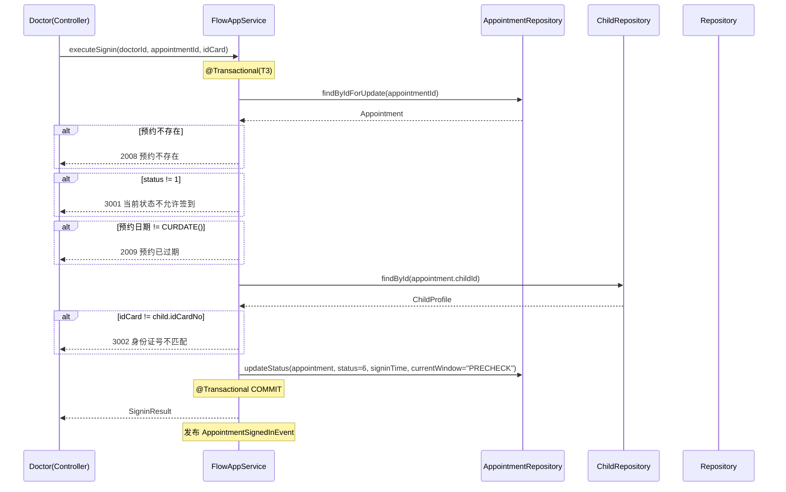
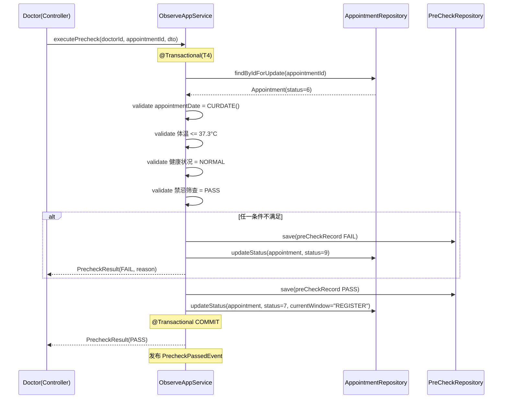
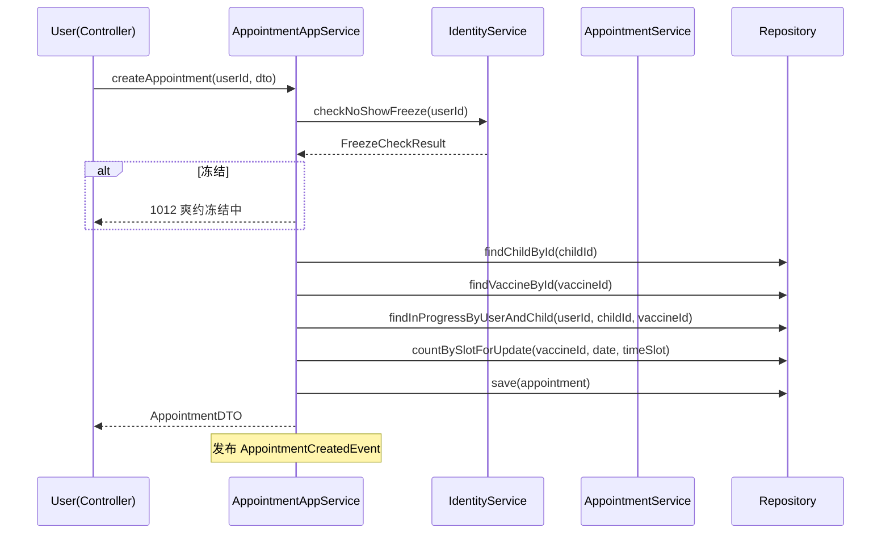
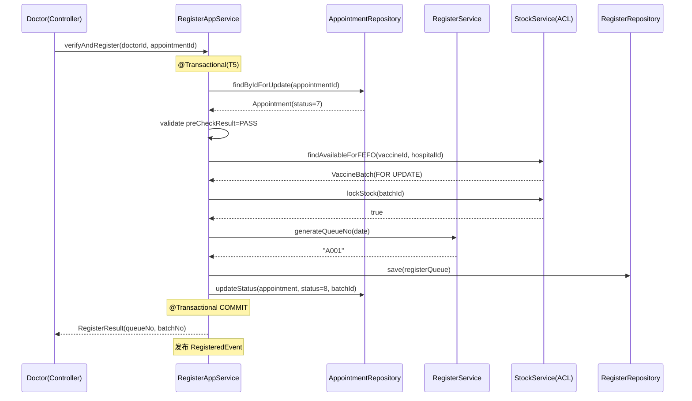
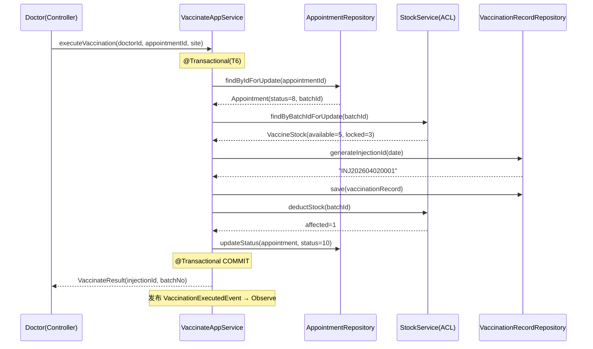
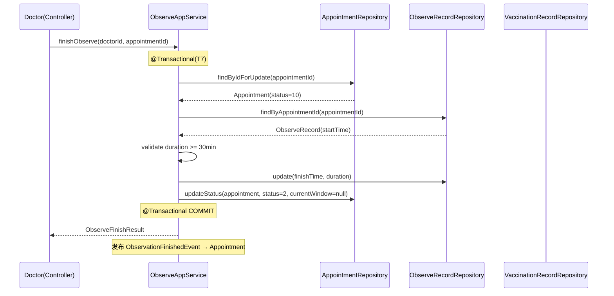

# 疫苗管理系统 — 应用层设计

**文档编号:** DOMAIN-APP-SERVICE-001
**版本:** V1.1
**状态:** 正式发布
**日期:** 2026-04-02
**上游依赖:** 全部 DOMAIN-{上下文} 文档

---

## 目录

1. [应用层概述](#1-应用层概述)
2. [应用服务清单](#2-应用服务清单)
3. [核心用例编排](#3-核心用例编排)
4. [DTO 定义](#4-dto-定义)
5. [统一异常处理](#5-统一异常处理)
6. [事件总线设计](#6-事件总线设计)

---

## 1. 应用层概述

### 1.1 定位

Application Service 是 Controller 层与 Domain 层之间的**编排层**。

### 1.2 职责

| 职责 | 说明 |
|------|------|
| 事务管理 | @Transactional 声明式事务 |
| 跨聚合协调 | 编排多个上下文的领域对象 |
| DTO 装配 | Request DTO → Domain Object → Response DTO |
| 权限校验 | 调用 @RequirePermission 注解校验 |
| 领域事件发布 | 事务内发布领域事件 |

### 1.3 设计原则

- Application Service **不包含业务逻辑**，业务逻辑在 Domain Service 中
- 一个 Application Service 对应一组用例
- 跨上下文调用通过 Repository 或 Application Service 接口，不直接依赖具体实现

---

## 2. 应用服务清单

### 2.1 AppointmentAppService

| 方法 | 用例 | 涉及上下文 | 事务 |
|------|------|-----------|------|
| createAppointment(userId, dto) | 用户预约 | Identity + Appointment | @Transactional |
| cancelAppointment(userId, appointmentId, reason) | 取消预约 | Appointment + Identity + Stock | @Transactional |
| getAppointmentDetail(userId, appointmentId) | 预约详情 | Appointment + Identity | 无 |
| listUserAppointments(userId, status, page) | 我的预约列表 | Appointment | 无 |
| getAppointmentGuide(userId, appointmentId) | 窗口指引 | Appointment + Flow | 无 |
| getQueueInfo(userId, appointmentId) | 排队信息 | Appointment + Flow | 无 |
| expireAppointments() | 过期定时任务 | Appointment | @Transactional |

### 2.2 FlowAppService

| 方法 | 用例 | 涉及上下文 | 事务 |
|------|------|-----------|------|
| executeSignin(doctorId, appointmentId, idCard) | 执行签到 | Appointment | @Transactional |
| getTodayAppointments(doctorId, date, filter) | 今日预约 | Appointment + Identity | 无 |
| getPrecheckQueue(doctorId, date) | 待预检队列 | Appointment + Identity | 无 |
| getRegisterQueue(doctorId, date) | 待登记队列 | Appointment + Identity | 无 |
| getVaccinateQueue(doctorId, date) | 待接种队列 | Appointment + Identity | 无 |

### 2.3 RegisterAppService

| 方法 | 用例 | 涉及上下文 | 事务 |
|------|------|-----------|------|
| verifyAndRegister(doctorId, appointmentId) | 登记+批次锁定 | Appointment + Register + Stock | @Transactional(T5) |
| getRegisterDetail(doctorId, appointmentId) | 登记详情 | Appointment + Identity + Register | 无 |
| getAvailableBatches(doctorId, vaccineId) | 可用批次 | Stock | 无 |
| switchBatch(doctorId, appointmentId, newBatchId) | 批次切换 | Stock | @Transactional |

### 2.4 VaccinateAppService

| 方法 | 用例 | 涉及上下文 | 事务 |
|------|------|-----------|------|
| executeVaccination(doctorId, appointmentId, site) | 执行接种 | Appointment + Vaccinate + Stock | @Transactional(T6) |
| verifyVaccination(doctorId, appointmentId) | 接种核实 | Appointment + Register + Stock + Identity | 无 |
| getVaccinateRecordList(doctorId, page) | 接种记录 | Vaccinate | 无 |
| getChildRecords(doctorId, childId) | 儿童接种记录 | Vaccinate + Identity | 无 |

### 2.5 ObserveAppService

| 方法 | 用例 | 涉及上下文 | 事务 |
|------|------|-----------|------|
| executePrecheck(doctorId, appointmentId, dto) | 执行预检 | Observe | @Transactional(T4) |
| getObserveQueue(doctorId, date) | 留观队列 | Appointment + Vaccinate + Identity | 无 |
| getObserveStatus(doctorId, injectionId) | 留观状态 | Appointment + Vaccinate | 无 |
| finishObserve(doctorId, appointmentId) | 确认留观结束 | Appointment + Observe | @Transactional(T7) |
| reportAdverse(doctorId, appointmentId, dto) | 上报不良反应 | Observe | @Transactional |
| handleAdverse(doctorId, reactionId, dto) | 处理不良反应 | Observe | @Transactional |

### 2.6 StockAppService

| 方法 | 用例 | 涉及上下文 | 事务 |
|------|------|-----------|------|
| getStockSummary(doctorId, vaccineId) | 库存汇总 | Stock | 无 |
| getBatchList(doctorId, vaccineId, page) | 批次列表 | Stock | 无 |
| getBatchDetail(doctorId, batchId) | 批次详情 | Stock | 无 |
| transferStock(doctorId, dto) | 库存调拨 | Stock | @Transactional(T8) |
| getTransferList(doctorId, page) | 调拨记录 | Stock | 无 |
| disposeBatch(doctorId, batchId, qty, reason) | 批次销毁 | Stock | @Transactional(T9) |
| getAlertList(doctorId, page) | 预警列表 | Stock | 无 |
| handleAlert(doctorId, alertId) | 处理预警 | Stock | 无 |
| scanExpiry() | 过期扫描 | Stock | @Transactional |
| scanAlerts() | 预警扫描 | Stock | 无 |

### 2.7 IdentityAppService

| 方法 | 用例 | 事务 |
|------|------|------|
| register(dto) | 用户注册 | @Transactional |
| login(phone, password) | 用户登录 | 无 |
| logout(userId) | 登出 | 无 |
| changePassword(userId, dto) | 修改密码 | @Transactional |
| resetPassword(dto) | 重置密码 | @Transactional |
| getUserProfile(userId) | 个人信息 | 无 |
| updateUserProfile(userId, dto) | 修改信息 | @Transactional |
| freezeUser(adminId, userId, reason) | 冻结用户 | @Transactional |
| unfreezeUser(adminId, userId) | 解冻用户 | @Transactional |
| getChildren(userId) / addChild / updateChild / deleteChild | 儿童档案 | @Transactional |
| getRoles / createRole / updateRole / deleteRole | 角色管理 | @Transactional |
| assignRolePermissions / assignUserRoles | 权限分配 | @Transactional |
| getConfigs / updateConfig | 系统配置 | @Transactional |

### 2.8 AdminAppService

| 方法 | 用例 | 涉及上下文 | 事务 |
|------|------|-----------|------|
| getVaccineList(keyword, type, page) | 疫苗目录列表 | Stock | 无 |
| addVaccine(dto) | 添加疫苗 | Stock | @Transactional |
| updateVaccine(vaccineId, dto) | 修改疫苗 | Stock | @Transactional |
| updateShelfStatus(vaccineId) | 上下架 | Stock | @Transactional |
| getWindowList | 窗口列表 | Identity | 无 |
| createWindow(dto) | 创建窗口 | Identity | @Transactional |
| updateWindow(windowId, dto) | 修改窗口 | Identity | @Transactional |
| getScheduleList(date) | 排班列表 | Identity | 无 |
| createSchedule(dto) | 创建排班 | Identity | @Transactional |
| updateSchedule(scheduleId, dto) | 修改排班 | Identity | @Transactional |
| deleteSchedule(scheduleId) | 删除排班 | Identity | @Transactional |
| getNoticeList(status, page) | 公告列表 | Identity | 无 |
| createNotice(dto) | 创建公告 | Identity | @Transactional |
| updateNotice(noticeId, dto) | 修改公告 | Identity | @Transactional |
| auditNotice(noticeId, dto) | 审核公告 | Identity | @Transactional |
| getOverviewStats | 总览统计 | Appointment + Stock | 无 |
| getVaccinationStats(startDate, endDate) | 接种统计 | Vaccinate | 无 |

---

## 3. 核心用例编排

### 3.0 签到流程（T3）



**签到业务规则：**

| 规则 | 说明 |
|------|------|
| 前置状态 | appointment.status = 1（已预约） |
| 日期校验 | appointment_date = CURDATE()，非当日不可签到 |
| 身份核验 | 提交的身份证号必须与儿童档案 id_card_no 一致 |
| 写入字段 | status → 6, signin_time → NOW(), current_window → "PRECHECK" |
| 事务编号 | T3 |
| 执行角色 | DOCTOR_SIGNIN |

### 3.0a 预检流程（T4）



**预检业务规则：**

| 规则 | 说明 |
|------|------|
| 前置状态 | appointment.status = 6（已签到） |
| 日期校验 | appointment_date = CURDATE() |
| 体温校验 | body_temperature <= 37.3°C |
| 健康状况 | health_status != ABNORMAL |
| 禁忌筛查 | contraindication_result = PASS |
| 通过 | status → 7, current_window → "REGISTER" |
| 失败 | status → 9, current_window → null |
| 事务编号 | T4 |
| 执行角色 | DOCTOR_PRECHECK |

### 3.1 用户预约流程

| 规则 | 说明 |
|------|------|
| 前置状态 | appointment.status = 1（已预约） |
| 日期校验 | appointment_date = CURDATE()，非当日不可签到 |
| 身份核验 | 提交的身份证号必须与儿童档案 id_card_no 一致 |
| 写入字段 | status → 6, signin_time → NOW(), current_window → "PRECHECK" |
| 事务编号 | T3 |
| 执行角色 | DOCTOR_SIGNIN |

### 3.1 用户预约流程



### 3.2 登记批次锁定流程（T5）



### 3.3 接种执行流程（T6）



### 3.4 留观结束流程（T7）



---

## 4. DTO 定义

### 4.1 Request DTO

| DTO 名称 | 用途 | 关键字段 |
|---------|------|---------|
| AppointmentCreateRequest | 创建预约 | childId, vaccineId, appointmentDate, timeSlot |
| CancelAppointmentRequest | 取消预约 | reason |
| SigninRequest | 执行签到 | appointmentId, idCard |
| PrecheckRequest | 预检评估 | appointmentId, bodyTemperature, healthStatus, ... |
| VaccinateRequest | 执行接种 | appointmentId, injectionSite |
| AdverseReportRequest | 上报不良反应 | appointmentId, reactionType, description, severity |
| TransferRequest | 库存调拨 | batchId, fromType, fromId, toType, toId, quantity |
| DisposeRequest | 批次销毁 | batchId, disposeQuantity, disposeReason |
| RegisterRequest | 用户注册 | phone, smsCode, password |
| LoginRequest | 用户登录 | phone, password |
| ChildRequest | 儿童档案 | name, gender, birthDate, ... |
| RoleRequest | 角色 | roleCode, roleName, roleGroup, description |
| PermissionAssignRequest | 权限分配 | permissionCodes[] |
| UserRolesAssignRequest | 用户角色分配 | roleIds[] |
| ChangePasswordRequest | 修改密码 | oldPassword, newPassword |
| ResetPasswordRequest | 重置密码 | phone, smsCode, newPassword |
| UpdateProfileRequest | 修改资料 | realName, gender, idCardType, idCardNo |
| ConfigUpdateRequest | 更新配置 | configs: List<ConfigItem> |
| VaccineCreateRequest | 添加疫苗 | vaccineName, vaccineType, manufacturer, description |
| VaccineUpdateRequest | 修改疫苗 | vaccineName, vaccineType, manufacturer, description |
| WindowCreateRequest | 创建窗口 | windowCode, windowName, windowFunctionType, capacity |
| WindowUpdateRequest | 修改窗口 | windowName, windowFunctionType, capacity, status |
| ScheduleCreateRequest | 创建排班 | doctorId, windowId, scheduleDate, timeSlot, maxCapacity |
| ScheduleUpdateRequest | 修改排班 | doctorId, windowId, scheduleDate, timeSlot, status, maxCapacity |
| NoticeCreateRequest | 创建公告 | title, content, noticeType |
| NoticeUpdateRequest | 修改公告 | title, content, noticeType |
| NoticeAuditRequest | 审核公告 | status, auditReason |
| NoticeFeedbackRequest | 公告反馈 | content |

### 4.2 Response DTO

| DTO 名称 | 用途 | 关键字段 |
|---------|------|---------|
| AppointmentDTO | 预约信息 | id, appointmentNo, status, vaccineName, childName, date, slot |
| AppointmentGuideDTO | 窗口指引 | appointmentId, status, nextGuide{action, message, window} |
| QueueInfoDTO | 排队信息 | windowCode, currentQueue, capacity, estimatedWaitTime |
| RegisterResultDTO | 登记结果 | registerId, queueNo, batchNo |
| VaccinateResultDTO | 接种结果 | injectionId, batchNo, injectionSite |
| ObserveQueueDTO | 留观队列 | childName, injectionId, duration, remaining, status |
| StockSummaryDTO | 库存汇总 | vaccineId, vaccineName, totalStock, availableStock |
| BatchDTO | 批次信息 | batchNo, manufacturer, expiryDate, status, availableStock |
| UserDTO | 用户信息 | id, username, phone, realName, status |
| ChildDTO | 儿童信息 | id, name, gender, birthDate, ... |
| RoleDTO | 角色信息 | id, roleCode, roleName, permissions[] |
| PageDTO\<T\> | 分页 | records, total, page, size, pages |
| VaccineDTO | 疫苗信息 | id, vaccineName, vaccineType, manufacturer, isOnShelf |
| WindowDTO | 窗口信息 | id, windowCode, windowName, windowFunctionType, capacity, status |
| ScheduleDTO | 排班信息 | id, doctorId, windowId, scheduleDate, timeSlot, status, maxCapacity |
| NoticeDTO | 公告信息 | id, title, content, noticeType, status, publishTime |
| OverviewStatsDTO | 总览统计 | todayAppointments, todayVaccinations, totalUsers, lowStockAlerts |
| VaccinationStatsDTO | 接种统计 | date, totalVaccinations, byType: Map |

---

## 5. 统一异常处理

### 5.1 全局异常处理器

```java
@RestControllerAdvice
public class GlobalExceptionHandler {

    @ExceptionHandler(BusinessException.class)
    public ResponseEntity<ApiResponse<Void>> handleBusiness(BusinessException e) {
        return ResponseEntity.ok()
            .body(ApiResponse.error(e.getCode(), e.getMessage()));
    }

    @ExceptionHandler(MethodArgumentNotValidException.class)
    public ResponseEntity<ApiResponse<Void>> handleValidation(MethodArgumentNotValidException e) {
        String field = e.getBindingResult().getFieldErrors().get(0).getField();
        return ResponseEntity.ok()
            .body(ApiResponse.error(1003, "参数校验失败：" + field));
    }

    @ExceptionHandler(AccessDeniedException.class)
    public ResponseEntity<ApiResponse<Void>> handleAccessDenied(AccessDeniedException e) {
        return ResponseEntity.status(403)
            .body(ApiResponse.error(1002, "无权限访问"));
    }

    @ExceptionHandler(AuthenticationException.class)
    public ResponseEntity<ApiResponse<Void>> handleAuth(AuthenticationException e) {
        return ResponseEntity.status(401)
            .body(ApiResponse.error(1001, "未认证或Token无效"));
    }

    @ExceptionHandler(Exception.class)
    public ResponseEntity<ApiResponse<Void>> handleException(Exception e) {
        log.error("系统异常", e);
        return ResponseEntity.status(500)
            .body(ApiResponse.error(1007, "系统繁忙，请稍后重试"));
    }
}
```

---

## 6. 事件总线设计

### 6.1 实现方案

- 使用 Spring `ApplicationEventPublisher` 实现同步事件总线
- 事件在事务边界内发布，事务回滚则事件不发布
- 事件处理器使用 `@TransactionalEventListener(phase = AFTER_COMMIT)` 确保事务提交后处理

### 6.2 事件处理器

| 事件 | 处理器 | 动作 |
|------|--------|------|
| AppointmentCancelledEvent | StockReleaseHandler | 释放锁定库存 |
| VaccinationExecutedEvent | ObserveStartHandler | 创建留观记录 |
| ObservationFinishedEvent | AppointmentCompletionHandler | 发送完成通知 |

### 6.3 幂等性保证

- 所有事件处理器必须幂等
- 使用 appointment_id + event_type 作为去重键
- 未来可升级为消息队列（异步事件）

### 6.4 事件处理失败补偿

关键事件处理失败时的补偿策略：

| 事件 | 失败影响 | 补偿机制 |
|------|---------|---------|
| VaccinationExecuted → 创建留观记录 | 预约 status=10 但无留观记录 | 留观医生操作 finishObserve 时，若 ObserveRecord 不存在则自动创建 |
| AppointmentCancelled → 释放库存 | locked_stock 未释放 | 定时任务对比 status=3 且 batch_id IS NOT NULL 的预约，补偿释放 |
| ObservationFinished → 更新预约状态 | 预约停留在 status=10 | 留观超时扫描任务（超过60分钟自动结束）兜底处理 |

---

## 版本历史

| 版本 | 日期 | 变更说明 |
|------|------|----------|
| V1.0 | 2026-04-02 | 初始版本 |
| V1.1 | 2026-04-03 | REQ-DOMAIN 一致性评审修复（P1：补充 T4 预检方法+序列图，P3：listUserAppointments 增加 status 参数，补充 4 个 Request DTO） |
| V1.2 | 2026-04-03 | 新增文档评审修复（P1：新增 AdminAppService 17 个方法 + 10 个 DTO） |

---

**文档结束**
