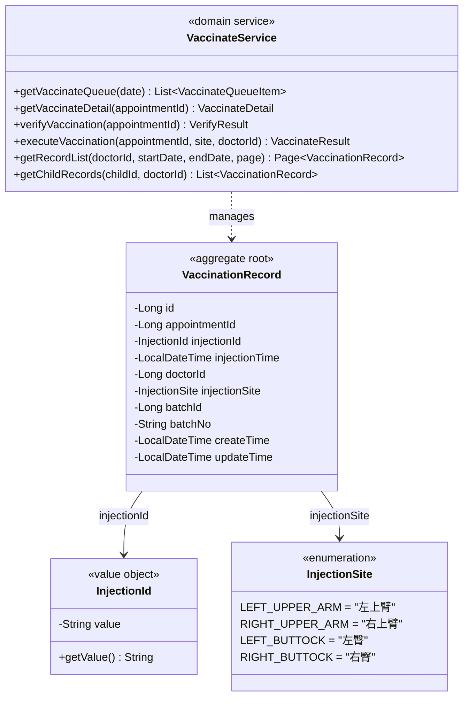

# 疫苗管理系统 — 接种上下文领域模型

**文档编号:** DOMAIN-VACCINATE-001
**版本:** V1.1
**状态:** 正式发布
**日期:** 2026-04-02
**上游依赖:** REQ-VACCINATE V1.0 / REQ-GLOBAL V1.0

---

## 目录

1. [上下文概述](#1-上下文概述)
2. [聚合设计](#2-聚合设计)
3. [实体详细定义](#3-实体详细定义)
4. [值对象定义](#4-值对象定义)
5. [领域服务](#5-领域服务)
6. [领域事件](#6-领域事件)
7. [仓储接口](#7-仓储接口)
8. [物理数据模型](#8-物理数据模型)
9. [与其他上下文的关系](#9-与其他上下文的关系)

---

## 1. 上下文概述

### 1.1 核心定位

Vaccinate Context 是系统的**核心执行上下文**。负责接种执行、库存扣减（核心事务 T6）、注射号生成、接种记录管理。

### 1.2 职责边界

| 职责 | 本上下文 | 其他上下文 |
|------|---------|-----------|
| 待接种队列查看 | **负责** | — |
| 接种前核实 | **负责** | — |
| 执行接种（status 8→10） | **负责** | — |
| 库存扣减 | **负责**（调用 Stock ACL） | Stock Context 执行 |
| 注射号生成 | **负责** | — |
| 接种记录查看 | **负责** | — |

### 1.3 防重复接种

三层防护机制：
1. **状态校验**：`status` 必须为 8（已登记）
2. **行锁保护**：`SELECT FOR UPDATE` 锁定预约行
3. **唯一约束**：`vaccination_record.appointment_id` 为 UNIQUE

---

## 2. 聚合设计



---

## 3. 实体详细定义

### 3.1 VaccinationRecord（接种记录）

| 字段 | 类型 | 约束 | 说明 |
|------|------|------|------|
| id | bigint | PK, auto_increment | 接种记录ID |
| appointment_id | bigint | UNIQUE, NOT NULL, FK → appointment.id | 预约ID（一对一，防重复） |
| injection_id | varchar(30) | UNIQUE, NOT NULL | 注射号，格式：INJ + YYYYMMDD + 4位日序号 |
| injection_time | datetime | NOT NULL | 接种执行时间 |
| doctor_id | bigint | NOT NULL, FK → sys_user.id | 接种医生ID |
| injection_site | varchar(30) | NOT NULL | 接种部位（枚举） |
| batch_id | bigint | NOT NULL, FK → vaccine_batch.id | 批次ID |
| batch_no | varchar(50) | NOT NULL | 批次号（冗余） |
| create_time | datetime | NOT NULL, DEFAULT CURRENT_TIMESTAMP | 创建时间 |
| update_time | datetime | NOT NULL, DEFAULT CURRENT_TIMESTAMP ON UPDATE | 更新时间 |

---

## 4. 值对象定义

### 4.1 InjectionId（注射号）

- 格式：`INJ` + `YYYYMMDD` + 4位日序号（如 INJ202604020001）
- 每日重置，从 0001 开始递增
- 全局唯一（UNIQUE 约束）

### 4.2 InjectionSite（接种部位）

| 编码 | 枚举名 | 中文 |
|------|--------|------|
| LEFT_UPPER_ARM | LEFT_UPPER_ARM | 左上臂 |
| RIGHT_UPPER_ARM | RIGHT_UPPER_ARM | 右上臂 |
| LEFT_BUTTOCK | LEFT_BUTTOCK | 左臀 |
| RIGHT_BUTTOCK | RIGHT_BUTTOCK | 右臀 |

---

## 5. 领域服务

### 5.1 VaccinateService

#### 5.1.1 executeVaccination — 执行接种（核心事务 T6）

```java
/**
 * 执行接种 — 核心事务 T6
 *
 * 事务范围：appointment + vaccination_record + hospital_vaccine_stock
 *
 * 步骤：
 * 1. 锁定预约行，校验 status=8
 * 2. 锁定库存行，校验 available_stock >= 1 AND locked_stock >= 1
 * 3. 生成注射号（唯一）
 * 4. 保存接种记录
 * 5. 扣减库存（available_stock -1, locked_stock -1）
 * 6. 更新预约状态为 10
 */
@Transactional(rollbackFor = Exception.class, timeout = 30)
public VaccinateResult executeVaccination(Long appointmentId,
                                           String injectionSite,
                                           Long doctorId) {
    // 1. 锁定预约行
    Appointment appointment = appointmentRepository.findByIdForUpdate(appointmentId);
    if (appointment == null) {
        throw new BusinessException(2008, "预约不存在");
    }
    if (appointment.getStatus() != AppointmentStatus.REGISTERED.getCode()) {
        throw new BusinessException(6001, "当前状态不允许接种");
    }

    Long batchId = appointment.getBatchId();
    if (batchId == null) {
        throw new BusinessException(6002, "未分配批次");
    }

    // 2. 锁定库存行
    VaccineStock stock = stockRepository.findByBatchIdForUpdate(batchId);
    if (stock.getAvailableStock() < 1 || stock.getLockedStock() < 1) {
        throw new BusinessException(6002, "批次库存不足");
    }

    // 2.5 批次过期校验（防御性——verifyVaccination 已覆盖，此处兜底）
    VaccineBatch batch = batchRepository.findById(batchId);
    if (batch.getExpiryDate().isBefore(LocalDate.now())) {
        throw new BusinessException(6003, "批次已过期");
    }

    // 3. 生成注射号（重试3次）
    String injectionId = generateInjectionIdWithRetry(LocalDate.now(), 3);

    // 4. 保存接种记录（batch 已在步骤 2.5 获取）
    VaccinationRecord record = new VaccinationRecord();
    record.setAppointmentId(appointmentId);
    record.setInjectionId(injectionId);
    record.setInjectionTime(LocalDateTime.now());
    record.setDoctorId(doctorId);
    record.setInjectionSite(injectionSite);
    record.setBatchId(batchId);
    record.setBatchNo(batch.getBatchNo());
    vaccinationRecordRepository.save(record);

    // 5. 扣减库存
    int affected = stockRepository.deductStock(batchId);
    if (affected == 0) {
        throw new BusinessException(6006, "库存扣减失败");
    }

    // 6. 更新预约状态
    appointment.setStatus(AppointmentStatus.OBSERVING.getCode());
    appointment.setCurrentWindow("OBSERVE");
    appointmentRepository.updateStatus(appointment);

    // 7. 发布事件
    eventBus.publish(new VaccinationExecutedEvent(
        appointmentId, injectionId, batchId, doctorId, injectionSite));

    return new VaccinateResult(record.getId(), injectionId, batch.getBatchNo(), injectionSite);
}

private String generateInjectionIdWithRetry(LocalDate date, int maxRetry) {
    for (int i = 0; i < maxRetry; i++) {
        try {
            return vaccinationRecordRepository.generateInjectionId(date);
        } catch (DuplicateKeyException e) {
            if (i == maxRetry - 1) {
                throw new BusinessException(6005, "注射号生成失败");
            }
        }
    }
    throw new BusinessException(6005, "注射号生成失败");
}
```

#### 5.1.2 verifyVaccination — 接种前核实

```java
/**
 * 接种前核实（只读操作）
 * 校验：预约状态=8、儿童信息、批次信息、批次未过期
 */
public VerifyResult verifyVaccination(Long appointmentId) {
    Appointment appointment = appointmentRepository.findById(appointmentId);
    if (appointment.getStatus() != AppointmentStatus.REGISTERED.getCode()) {
        throw new BusinessException(6001, "当前状态不允许接种");
    }

    // 查询儿童信息
    ChildProfile child = childRepository.findById(appointment.getChildId());

    // 查询批次信息
    VaccineBatch batch = batchRepository.findById(appointment.getBatchId());
    if (batch.getExpiryDate().isBefore(LocalDate.now())) {
        throw new BusinessException(6003, "批次已过期");
    }

    // 查询库存
    VaccineStock stock = stockRepository.findByBatchId(appointment.getBatchId());
    if (stock.getAvailableStock() < 1) {
        throw new BusinessException(6002, "批次库存不足");
    }

    return new VerifyResult(appointment, child, batch, stock);
}
```

#### 5.1.3 getVaccinateQueue — 待接种队列

```java
/**
 * 待接种队列（只读）
 * 筛选条件：status=8 AND appointment_date = CURDATE()
 * 排序：register_time ASC（Repository 实现按 signin_time ASC 排序，
 *        两者语义等价——均在登记/签到时写入，可作为排序依据）
 */
public List<VaccinateQueueItem> getVaccinateQueue(LocalDate date) {
    return appointmentRepository.findQueueByStatusAndDate(
        AppointmentStatus.REGISTERED.getCode(), date);
}
```

#### 5.1.4 getVaccinationStatistics — 接种统计查询

```java
/**
 * 接种统计查询（只读）
 * 支持按日期范围、疫苗、医生维度统计
 */
public VaccinationStatistics getVaccinationStatistics(LocalDate startDate,
                                                      LocalDate endDate,
                                                      Long vaccineId,
                                                      Long doctorId) {
    // 基础统计
    int totalCount = vaccinationRecordRepository.countByDateRange(startDate, endDate,
        vaccineId, doctorId);
    int todayCount = vaccinationRecordRepository.countByDateRange(LocalDate.now(),
        LocalDate.now(), vaccineId, doctorId);

    // 按疫苗维度分组统计
    List<VaccineStatItem> byVaccine = vaccinationRecordRepository
        .groupByVaccine(startDate, endDate, doctorId);

    // 按日期维度统计趋势
    List<DailyStatItem> byDate = vaccinationRecordRepository
        .groupByDate(startDate, endDate, vaccineId, doctorId);

    return new VaccinationStatistics(totalCount, todayCount, byVaccine, byDate);
}
```

**统计 SQL 示例：**

```sql
-- 按疫苗分组统计
SELECT v.vaccine_name, COUNT(*) AS total,
       DATE(vr.injection_time) AS stat_date
FROM vaccination_record vr
JOIN vaccine v ON vr.batch_id IN (SELECT id FROM vaccine_batch WHERE vaccine_id = v.id)
WHERE vr.injection_time >= #{startDate}
  AND vr.injection_time < #{endDate + 1}
  AND (#{doctorId} IS NULL OR vr.doctor_id = #{doctorId})
GROUP BY v.id, DATE(vr.injection_time)
ORDER BY stat_date ASC;
```

#### 5.1.5 重试策略

| 操作 | 最大重试次数 | 重试间隔 | 退避策略 |
|------|-------------|---------|---------|
| 注射号生成 | 3 | 即时 | 立即重试 |
| 库存扣减 | 3 | 100ms, 200ms, 400ms | 指数退避 |

---

## 6. 领域事件

| 事件名 | 触发时机 | 携带数据 | 消费者 |
|--------|---------|---------|--------|
| `VaccinationExecutedEvent` | 接种完成 | appointmentId, injectionId, batchId, doctorId, injectionSite | Observe Context |

---

## 7. 仓储接口

```java
public interface VaccinationRecordRepository {
    VaccinationRecord findByAppointmentId(Long appointmentId);
    VaccinationRecord findByInjectionId(String injectionId);
    void save(VaccinationRecord record);
    String generateInjectionId(LocalDate date);
    Page<VaccinationRecord> findByDoctorId(Long doctorId, Pageable pageable);
    List<VaccinationRecord> findByChildIdAndDoctorId(Long childId, Long doctorId);
}
```

---

## 8. 物理数据模型

### 8.1 ER 关系图

```mermaid
erDiagram
    VACCINATION_RECORD {
        bigint id PK
        bigint appointment_id UK_FK "预约ID"
        varchar injection_id UK "注射号"
        datetime injection_time "接种时间"
        bigint doctor_id FK "接种医生"
        varchar injection_site "接种部位"
        bigint batch_id FK "批次ID"
        varchar batch_no "批次号"
        datetime create_time
        datetime update_time
    }

    APPOINTMENT ||--o| VACCINATION_RECORD : "1:1"
    SYS_USER ||--o{ VACCINATION_RECORD : "1:N"
    VACCINE_BATCH ||--o{ VACCINATION_RECORD : "1:N"
```

### 8.2 DDL

```sql
-- ============================================================
-- 接种记录表
-- 所属上下文: Vaccinate Context
-- ============================================================
CREATE TABLE `vaccination_record` (
    `id`              BIGINT       NOT NULL AUTO_INCREMENT COMMENT '接种记录ID',
    `appointment_id`  BIGINT       NOT NULL                COMMENT '预约ID（一对一，防重复接种）',
    `injection_id`    VARCHAR(30)  NOT NULL                COMMENT '注射号（INJ+YYYYMMDD+4seq）',
    `injection_time`  DATETIME     NOT NULL                COMMENT '接种执行时间',
    `doctor_id`       BIGINT       NOT NULL                COMMENT '接种医生ID',
    `injection_site`  VARCHAR(30)  NOT NULL                COMMENT '接种部位（LEFT_UPPER_ARM/RIGHT_UPPER_ARM/LEFT_BUTTOCK/RIGHT_BUTTOCK）',
    `batch_id`        BIGINT       NOT NULL                COMMENT '批次ID',
    `batch_no`        VARCHAR(50)  NOT NULL                COMMENT '批次号（冗余）',
    `create_time`     DATETIME     NOT NULL DEFAULT CURRENT_TIMESTAMP COMMENT '创建时间',
    `update_time`     DATETIME     NOT NULL DEFAULT CURRENT_TIMESTAMP ON UPDATE CURRENT_TIMESTAMP COMMENT '更新时间',
    PRIMARY KEY (`id`),
    UNIQUE KEY `uk_appointment_id` (`appointment_id`),
    UNIQUE KEY `uk_injection_id` (`injection_id`),
    KEY `idx_doctor_id` (`doctor_id`),
    KEY `idx_batch_id` (`batch_id`),
    KEY `idx_injection_time` (`injection_time`)
) ENGINE=InnoDB DEFAULT CHARSET=utf8mb4 COLLATE=utf8mb4_general_ci COMMENT='接种记录表';
```

---

## 9. 与其他上下文的关系

| 依赖 | 交互方式 | 用途 |
|------|---------|------|
| Appointment Context | Repository（读+写） | 读取/更新预约状态和批次ID |
| Stock Context | Anti-Corruption Layer | 库存扣减（available_stock-1, locked_stock-1） |
| Identity Context | Repository（只读） | 查询儿童档案信息 |
| Register Context | Repository（只读） | 查询登记信息 |

---

## 版本历史

| 版本 | 日期 | 变更说明 |
|------|------|----------|
| V1.0 | 2026-04-02 | 初始版本，基于 REQ-VACCINATE V1.0 生成 |
| V1.1 | 2026-04-03 | REQ-DOMAIN 一致性评审修复（P2：批次过期防御性校验、队列排序说明，P3：getRecordList 增加日期参数） |

---

**文档结束**
