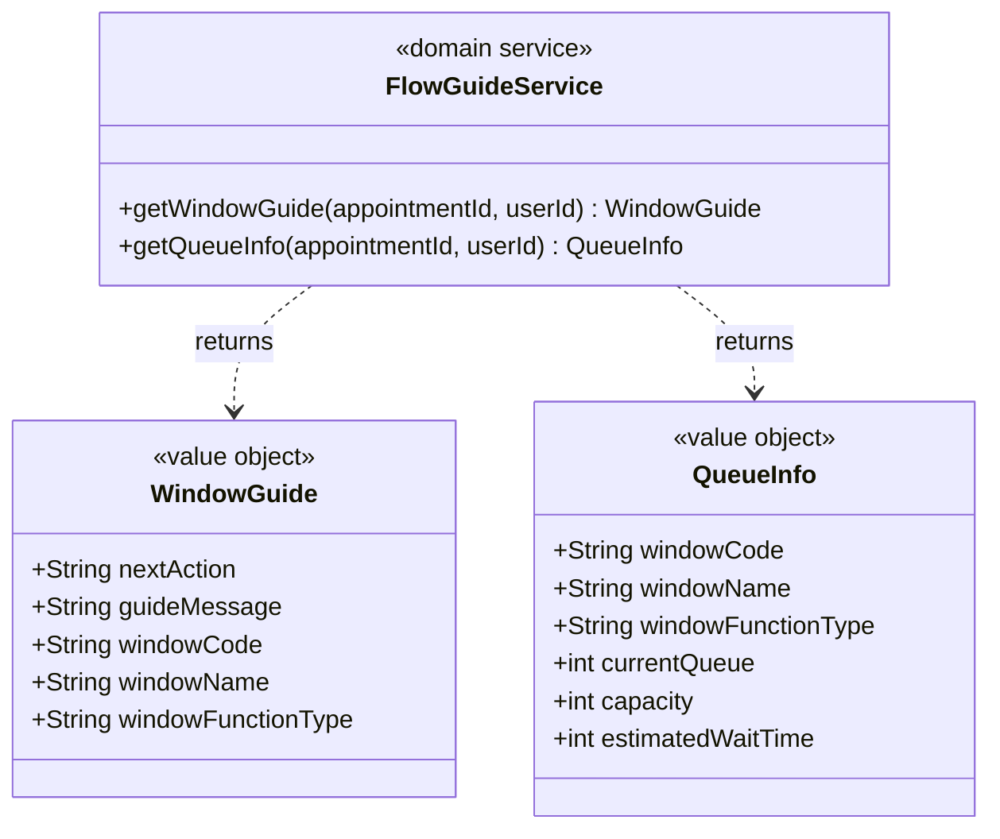
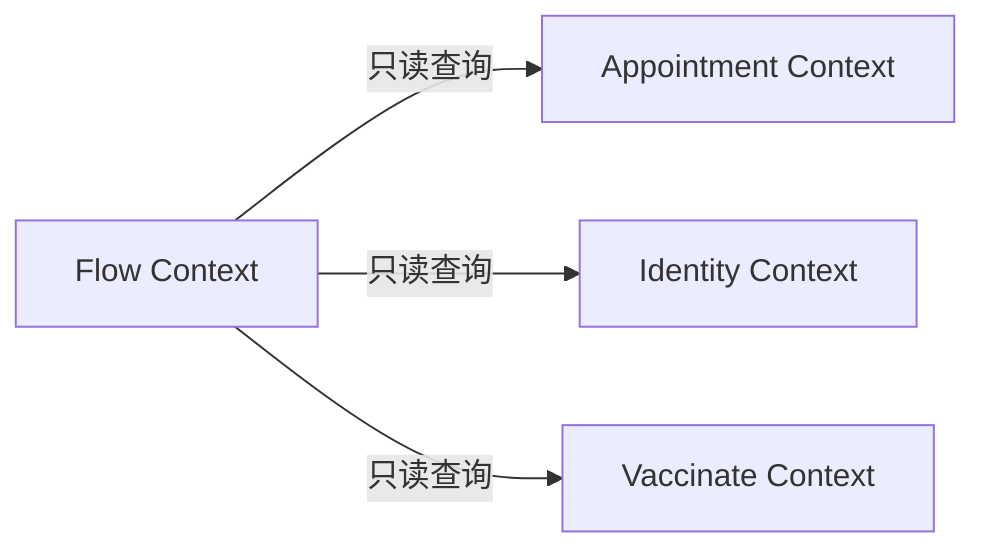

# 疫苗管理系统 — 流程指引上下文领域模型

**文档编号:** DOMAIN-FLOW-001
**版本:** V1.0
**状态:** 正式发布
**日期:** 2026-04-02
**上游依赖:** REQ-FLOW V1.0 / REQ-GLOBAL V1.0

---

## 目录

1. [上下文概述](#1-上下文概述)
2. [领域服务设计](#2-领域服务设计)
3. [值对象定义](#3-值对象定义)
4. [队列计算规则](#4-队列计算规则)
5. [仓储接口](#5-仓储接口)
6. [权限控制](#6-权限控制)
7. [物理数据模型](#7-物理数据模型)
8. [与其他上下文的关系](#8-与其他上下文的关系)

---

## 1. 上下文概述

### 1.1 核心定位

Flow Context 是系统的**纯查询/规则计算层**。本上下文**不持有任何聚合根**，不执行任何写操作，仅负责：
- **状态→窗口映射** — 根据预约状态计算应去窗口
- **流程指引** — 为用户端提供下一步操作提示
- **队列计算** — 基于预约记录统计各窗口排队信息

### 1.2 本上下文约束

> **严格禁止以下行为：**

| 禁止范围 | 说明 |
|----------|------|
| 禁止修改状态 | 不执行任何 `UPDATE appointment SET status = ...` |
| 禁止写核心表 | 不 INSERT/UPDATE appointment、vaccine_batch、hospital_vaccine_stock 等核心表 |
| 禁止执行业务操作 | 签到/预检/登记/接种/留观由各自执行上下文负责 |

### 1.3 与 REQ-FLOW 的对应

REQ-FLOW 中定义了 FLOW 作为纯规则层的定位，但同时也包含签到、预检、留观的**执行功能**。在 DDD 模型中，这些执行功能分别归属对应上下文：

| REQ-FLOW 功能 | DDD 上下文归属 |
|--------------|---------------|
| F-FLOW-001 获取窗口指引 | **Flow Context**（本上下文） |
| F-FLOW-002 获取排队信息 | **Flow Context**（本上下文） |
| F-FLOW-003 今日预约队列 | **Flow Context**（本上下文） |
| F-FLOW-004 待预检队列 | **Flow Context**（本上下文） |
| F-FLOW-005 留观队列 | **Observe Context** |
| F-FLOW-006 预检评估 | **Observe Context**（预检执行部分） |
| F-FLOW-007 禁忌筛查 | **Observe Context** |
| F-FLOW-008 留观状态监控 | **Observe Context** |
| F-FLOW-009 确认留观结束 | **Observe Context** |
| F-FLOW-010 上报不良反应 | **Observe Context** |
| F-FLOW-011 处理不良反应 | **Observe Context** |
| F-FLOW-008-SIGNIN 执行签到 | 由 Application Service 编排，Appointment Context 写入状态 |

---

## 2. 领域服务设计

### 2.1 FlowGuideService — 窗口指引服务



#### 2.1.1 getWindowGuide — 获取窗口指引

```java
/**
 * 获取窗口指引（纯查询，不修改任何数据）
 *
 * 前置条件：
 * 1. 用户已登录
 * 2. 预约记录存在
 * 3. 预约归属当前用户
 */
public WindowGuide getWindowGuide(Long appointmentId, Long userId) {
    // 1. 查询预约状态（只读）
    Appointment appointment = appointmentQueryRepo.findById(appointmentId);
    if (appointment == null) {
        throw new BusinessException(2008, "预约不存在");
    }
    if (!appointment.getUserId().equals(userId)) {
        throw new BusinessException(1002, "无权操作该预约");
    }

    // 2. 根据状态匹配指引规则（纯计算）
    int status = appointment.getStatus();
    String nextAction, guideMessage, windowFunctionType;

    switch (status) {
        case 1:  // 已预约
            nextAction = "签到"; guideMessage = "您已成功预约，请到签到窗口办理签到";
            windowFunctionType = "SIGNIN"; break;
        case 6:  // 已签到
            nextAction = "预检"; guideMessage = "签到成功，请到预检窗口等待预检";
            windowFunctionType = "PRECHECK"; break;
        case 7:  // 预检通过
            nextAction = "登记"; guideMessage = "预检通过，请到登记窗口排队";
            windowFunctionType = "REGISTER"; break;
        case 8:  // 已登记
            nextAction = "接种"; guideMessage = "登记完成，请到接种窗口等待接种";
            windowFunctionType = "VACCINATE"; break;
        case 10: // 留观中
            nextAction = "留观"; guideMessage = "接种完成，请在留观室观察30分钟";
            windowFunctionType = "OBSERVE"; break;
        case 2:  // 已完成
            return new WindowGuide("完成", "接种流程已完成，感谢您的配合", null, null, null);
        case 3:  // 已取消
            return new WindowGuide("已取消", "该预约已取消", null, null, null);
        case 4:  // 已过期
            return new WindowGuide("已过期", "该预约已过期，请重新预约", null, null, null);
        case 9:  // 预检失败
            return new WindowGuide("预检未通过", "预检未通过，请咨询医生后重新预约", null, null, null);
        default:
            throw new BusinessException(1007, "未知的预约状态");
    }

    // 3. 查询窗口信息（仅进行中状态）
    HospitalWindow window = windowQueryRepo
        .findByFunctionType(windowFunctionType)
        .orElse(null);

    return new WindowGuide(
        nextAction, guideMessage,
        window != null ? window.getWindowCode() : null,
        window != null ? window.getWindowName() : null,
        windowFunctionType);
}
```

#### 2.1.2 getQueueInfo — 获取排队信息

```java
/**
 * 获取排队信息（纯查询/计算，不修改任何数据）
 */
public QueueInfo getQueueInfo(Long appointmentId, Long userId) {
    Appointment appointment = appointmentQueryRepo.findById(appointmentId);
    // ... (归属校验同上)

    // 非进行中状态
    if (!AppointmentStatusMachine.isInProgress(appointment.getStatus())) {
        return new QueueInfo(null, null, null, 0, 0, 0);
    }

    // 根据状态确定目标窗口职能
    String windowFunctionType = statusToWindowType(appointment.getStatus());

    // 计算排队人数
    int currentQueue = appointmentQueryRepo
        .countByStatusAndDate(appointment.getStatus(), LocalDate.now()) - 1;

    // 查询窗口配置
    HospitalWindow window = windowQueryRepo.findByFunctionType(windowFunctionType).orElse(null);
    if (window == null) {
        return new QueueInfo(null, null, windowFunctionType, currentQueue, 0, 0);
    }

    int estimatedWaitTime = currentQueue * window.getAvgHandleTime();

    return new QueueInfo(
        window.getWindowCode(), window.getWindowName(),
        windowFunctionType, currentQueue,
        window.getCapacity(), estimatedWaitTime);
}
```

### 2.2 状态→窗口映射表

| 当前 status | 下一步窗口 | window_function_type | 指引消息 |
|-------------|-----------|---------------------|---------|
| 1 | 签到窗口 | SIGNIN | 您已成功预约，请到签到窗口办理签到 |
| 6 | 预检窗口 | PRECHECK | 签到成功，请到预检窗口等待预检 |
| 7 | 登记窗口 | REGISTER | 预检通过，请到登记窗口排队 |
| 8 | 接种窗口 | VACCINATE | 登记完成，请到接种窗口等待接种 |
| 10 | 留观室 | OBSERVE | 接种完成，请在留观室观察30分钟 |
| 2,3,4,9 | 无 | — | 终态提示 |

---

## 3. 值对象定义

### 3.1 WindowGuide（窗口指引）

| 字段 | 类型 | 说明 |
|------|------|------|
| nextAction | String | 下一步操作名称 |
| guideMessage | String | 指引消息 |
| windowCode | String | 窗口编码（终态为 null） |
| windowName | String | 窗口名称（终态为 null） |
| windowFunctionType | String | 窗口职能类型（终态为 null） |

### 3.2 QueueInfo（排队信息）

| 字段 | 类型 | 说明 |
|------|------|------|
| windowCode | String | 窗口编码 |
| windowName | String | 窗口名称 |
| windowFunctionType | String | 窗口职能类型 |
| currentQueue | int | 当前排队人数（不含自身） |
| capacity | int | 窗口容量 |
| estimatedWaitTime | int | 预估等待时间（分钟） |

---

## 4. 队列计算规则

### 4.1 各窗口队列定义

| 窗口职能 | 队列名称 | 筛选条件 | 排序规则 |
|---------|---------|---------|---------|
| SIGNIN | 今日预约队列 | `status IN (1,6,7,8,9,10) AND date = #{date}` | `create_time ASC` |
| PRECHECK | 待预检队列 | `status = 6 AND date = CURDATE()` | `signin_time ASC` |
| REGISTER | 待登记队列 | `status = 7 AND date = CURDATE()` | `signin_time ASC` |
| VACCINATE | 待接种队列 | `status = 8 AND date = CURDATE()` | `signin_time ASC` |
| OBSERVE | 留观队列 | `status = 10 AND date = CURDATE()` | `injection_time ASC` |

### 4.2 队列计算 SQL 示例

```sql
-- 签到医生：今日预约队列
SELECT a.id, a.appointment_no, a.status, a.appointment_date,
       a.time_slot, a.signin_time, cp.name AS child_name
FROM appointment a
LEFT JOIN child_profile cp ON a.child_id = cp.id
WHERE a.appointment_date = #{date}
  AND a.status IN (1, 6, 7, 8, 9, 10)
ORDER BY a.create_time ASC;

-- 预检医生：待预检队列
SELECT a.id, a.appointment_no, a.signin_time,
       TIMESTAMPDIFF(MINUTE, a.signin_time, NOW()) AS wait_duration,
       cp.name AS child_name
FROM appointment a
LEFT JOIN child_profile cp ON a.child_id = cp.id
WHERE a.appointment_date = CURDATE()
  AND a.status = 6
ORDER BY a.signin_time ASC;
```

---

## 5. 仓储接口

```java
/**
 * 只读仓储接口（Flow Context 不持有写仓储）
 */
public interface AppointmentQueryRepository {
    Appointment findById(Long id);
    List<Appointment> findTodayAppointments(LocalDate date, String filter);
    List<Appointment> findQueueByStatusAndDate(Integer status, LocalDate date);
    int countByStatusAndDate(Integer status, LocalDate date);
}

public interface HospitalWindowQueryRepository {
    Optional<HospitalWindow> findByFunctionType(String functionType);
    List<HospitalWindow> findAll();
}
```

---

## 6. 权限控制

| API | 权限编码 | 角色 | API前缀 |
|-----|---------|------|--------|
| getWindowGuide | appointment.view.own | USER | /api/user/* |
| getQueueInfo | appointment.view.own | USER | /api/user/* |
| getTodayAppointments | appointment.view.today | DOCTOR_SIGNIN | /api/signin/* |
| getPrecheckQueue | appointment.view.queue | DOCTOR_PRECHECK | /api/precheck/* |

---

## 7. 物理数据模型

Flow Context **不拥有任何数据库表**。所有查询基于其他上下文管理的表：

| 表 | 所属上下文 | Flow 访问方式 |
|----|-----------|--------------|
| appointment | Appointment Context | 只读 |
| hospital_window | Identity/Admin Context | 只读 |
| child_profile | Identity Context | 只读 |
| vaccination_record | Vaccinate Context | 只读（留观队列） |

---

## 8. 与其他上下文的关系



| 依赖 | 交互方式 | 用途 |
|------|---------|------|
| Appointment Context | 只读 Repository | 查询预约状态、排队信息 |
| Identity Context | 只读 Repository | 查询儿童姓名（队列显示） |
| Vaccinate Context | 只读 Repository | 查询接种时间（留观队列） |

---

## 版本历史

| 版本 | 日期 | 变更说明 |
|------|------|----------|
| V1.0 | 2026-04-02 | 初始版本，基于 REQ-FLOW V1.0 生成 |

---

**文档结束**
