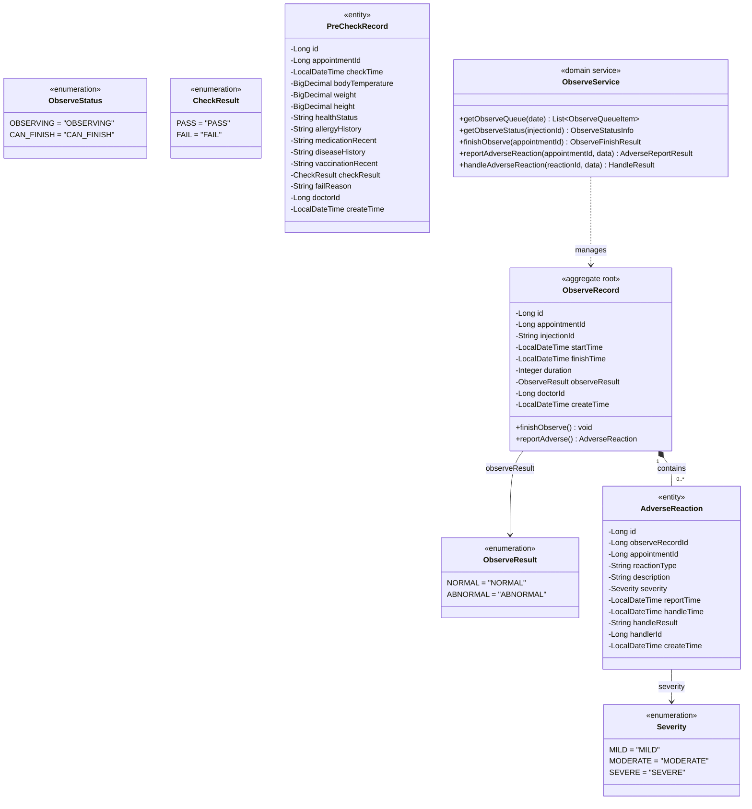

# 疫苗管理系统 — 留观上下文领域模型

**文档编号:** DOMAIN-OBSERVE-001
**版本:** V1.1
**状态:** 正式发布
**日期:** 2026-04-02
**上游依赖:** REQ-FLOW V1.0 / REQ-GLOBAL V1.0

---

## 目录

1. [上下文概述](#1-上下文概述)
2. [聚合设计](#2-聚合设计)
3. [实体详细定义](#3-实体详细定义)
4. [值对象定义](#4-值对象定义)
5. [领域服务](#5-领域服务)
6. [领域事件](#6-领域事件)
7. [仓储接口](#7-仓储接口)
8. [物理数据模型](#8-物理数据模型)
9. [与其他上下文的关系](#9-与其他上下文的关系)

---

## 1. 上下文概述

### 1.1 核心定位

Observe Context 负责接种后的留观监测。包括留观计时、留观结束确认、不良反应上报与处理。同时承担预检环节的记录保存（F-FLOW-006 预检评估、F-FLOW-007 禁忌筛查），因为预检与留观都属于流程窗口操作。

### 1.2 职责边界

| 职责 | 本上下文 | 其他上下文 |
|------|---------|-----------|
| 留观队列查看 | **负责** | — |
| 留观状态监控 | **负责** | — |
| 留观结束确认（status 10→2） | **负责**（协调 Appointment） | Appointment Context 存储 |
| 不良反应上报 | **负责** | — |
| 不良反应处理 | **负责** | — |
| 预检评估（F-FLOW-006） | **负责**（保存预检记录） | — |
| 禁忌筛查（F-FLOW-007） | **负责** | — |

### 1.3 关键规则

- 留观最短时长：30分钟（可通过 sys_config 配置）
- 留观开始时间 = 接种记录的 `injection_time`
- 留观异常（observe_result=ABNORMAL）时，必须先上报不良反应才能结束留观
- 由 VaccinationExecuted 事件触发

---

## 2. 聚合设计



---

## 3. 实体详细定义

### 3.1 PreCheckRecord（预检记录）

> 预检记录由预检医生在预检窗口创建，记录预检评估和禁忌筛查结果。本实体虽属于流程窗口操作，但因与留观同属 FLOW 模块，在此定义。

| 字段 | 类型 | 约束 | 说明 |
|------|------|------|------|
| id | bigint | PK, auto_increment | 预检记录ID |
| appointment_id | bigint | UNIQUE, NOT NULL, FK → appointment.id | 预约ID（一对一） |
| check_time | datetime | NOT NULL | 预检时间 |
| body_temperature | decimal(4,1) | NULL | 体温（如 37.2） |
| weight | decimal(5,1) | NULL | 体重（kg） |
| height | decimal(5,1) | NULL | 身高（cm） |
| health_status | varchar(20) | NULL | 健康状况评估 |
| allergy_history | text | NULL | 过敏史 |
| medication_recent | text | NULL | 近期用药情况 |
| disease_history | text | NULL | 疾病史 |
| vaccination_recent | text | NULL | 近期接种史 |
| check_result | varchar(10) | NOT NULL | 预检结果（PASS/FAIL） |
| fail_reason | varchar(500) | NULL | 预检失败原因（result=FAIL时必填） |
| doctor_id | bigint | NOT NULL, FK → sys_user.id | 预检医生ID |
| create_time | datetime | NOT NULL, DEFAULT CURRENT_TIMESTAMP | 创建时间 |

### 3.2 ObserveRecord（留观记录）

| 字段 | 类型 | 约束 | 说明 |
|------|------|------|------|
| id | bigint | PK, auto_increment | 留观记录ID |
| appointment_id | bigint | UNIQUE, NOT NULL, FK → appointment.id | 预约ID |
| injection_id | varchar(30) | NOT NULL | 注射号 |
| start_time | datetime | NOT NULL | 留观开始时间（=接种时间） |
| finish_time | datetime | NULL | 留观结束时间 |
| duration | int | NULL | 留观时长（分钟） |
| observe_result | varchar(20) | NOT NULL, DEFAULT 'NORMAL' | 留观结果（NORMAL/ABNORMAL） |
| doctor_id | bigint | NOT NULL, FK → sys_user.id | 留观医生ID |
| create_time | datetime | NOT NULL, DEFAULT CURRENT_TIMESTAMP | 创建时间 |

### 3.2 AdverseReaction（不良反应）

| 字段 | 类型 | 约束 | 说明 |
|------|------|------|------|
| id | bigint | PK, auto_increment | 不良反应ID |
| observe_record_id | bigint | NOT NULL, FK → observe_record.id | 留观记录ID |
| appointment_id | bigint | NOT NULL, FK → appointment.id | 预约ID |
| reaction_type | varchar(50) | NOT NULL | 反应类型（发热、皮疹、红肿等） |
| description | text | NULL | 详细描述 |
| severity | varchar(20) | NOT NULL | 严重程度（MILD/MODERATE/SEVERE） |
| report_time | datetime | NOT NULL | 上报时间 |
| handle_time | datetime | NULL | 处理时间 |
| handle_result | text | NULL | 处理结果 |
| handler_id | bigint | NULL, FK → sys_user.id | 处理医生ID |
| create_time | datetime | NOT NULL, DEFAULT CURRENT_TIMESTAMP | 创建时间 |

---

## 4. 值对象定义

| 值对象 | 枚举值 | 说明 |
|--------|--------|------|
| ObserveResult | NORMAL, ABNORMAL | 留观结果 |
| Severity | MILD(轻度), MODERATE(中度), SEVERE(重度) | 不良反应严重程度 |
| ObserveStatus | OBSERVING, CAN_FINISH | 留观状态（duration < 30min / >= 30min） |

---

## 5. 领域服务

### 5.1 ObserveService

#### 5.1.0 executePrecheck — 执行预检评估（事务 T4）

> **分层说明：** 事务管理由 Application Service（ObserveAppService.executePrecheck）统一声明。
> 领域服务不直接使用 @Transactional 注解，遵循 DDD 分层原则。

```java
/**
 * 执行预检评估 — 事务 T4
 *
 * 前置条件：
 * 1. 预约 status=6（已签到）
 * 2. 预约日期 = CURDATE()
 *
 * 业务规则：
 * - 体温 > 37.3°C → 预检失败（status → 9）
 * - 健康状况异常 → 预检失败（status → 9）
 * - 禁忌筛查不通过 → 预检失败（status → 9）
 * - 其余情况 → 预检通过（status → 7）
 */
public PrecheckResult executePrecheck(Long appointmentId, PrecheckData data,
                                      Long doctorId) {
    // 1. 锁定预约行
    Appointment appointment = appointmentRepository.findByIdForUpdate(appointmentId);
    if (appointment == null) {
        throw new BusinessException(2008, "预约不存在");
    }
    if (appointment.getStatus() != AppointmentStatus.SIGNED_IN.getCode()) {
        throw new BusinessException(3003, "当前状态不允许预检");
    }
    if (!appointment.getAppointmentDate().equals(LocalDate.now())) {
        throw new BusinessException(2009, "非当日预约");
    }

    // 2. 体温校验
    BigDecimal maxTemp = new BigDecimal("37.3");
    if (data.getBodyTemperature() != null
            && data.getBodyTemperature().compareTo(maxTemp) > 0) {
        return failPrecheck(appointment, doctorId, data, "体温异常：" + data.getBodyTemperature() + "°C");
    }

    // 3. 保存预检记录
    PreCheckRecord record = new PreCheckRecord();
    record.setAppointmentId(appointmentId);
    record.setCheckTime(LocalDateTime.now());
    record.setBodyTemperature(data.getBodyTemperature());
    record.setWeight(data.getWeight());
    record.setHeight(data.getHeight());
    record.setHealthStatus(data.getHealthStatus());
    record.setAllergyHistory(data.getAllergyHistory());
    record.setMedicationRecent(data.getMedicationRecent());
    record.setDiseaseHistory(data.getDiseaseHistory());
    record.setVaccinationRecent(data.getVaccinationRecent());
    record.setDoctorId(doctorId);

    // 4. 判定结果
    boolean hasContraindication = data.getContraindicationResult() != null
        && "FAIL".equals(data.getContraindicationResult());
    boolean healthAbnormal = "ABNORMAL".equals(data.getHealthStatus());

    if (hasContraindication || healthAbnormal) {
        String reason = hasContraindication ? "禁忌筛查不通过" : "健康状况异常";
        return failPrecheck(appointment, doctorId, data, reason);
    }

    // 5. 预检通过
    record.setCheckResult(CheckResult.PASS);
    preCheckRepository.save(record);

    appointment.setStatus(AppointmentStatus.PRECHECK_PASS.getCode());
    appointment.setCurrentWindow("REGISTER");
    appointmentRepository.updateStatus(appointment);

    eventBus.publish(new PrecheckPassedEvent(appointmentId, doctorId));

    return new PrecheckResult(appointmentId, "PASS", null);
}

private PrecheckResult failPrecheck(Appointment appointment, Long doctorId,
                                     PrecheckData data, String reason) {
    PreCheckRecord record = new PreCheckRecord();
    record.setAppointmentId(appointment.getId());
    record.setCheckTime(LocalDateTime.now());
    record.setBodyTemperature(data.getBodyTemperature());
    record.setWeight(data.getWeight());
    record.setHeight(data.getHeight());
    record.setHealthStatus(data.getHealthStatus());
    record.setAllergyHistory(data.getAllergyHistory());
    record.setMedicationRecent(data.getMedicationRecent());
    record.setDiseaseHistory(data.getDiseaseHistory());
    record.setVaccinationRecent(data.getVaccinationRecent());
    record.setCheckResult(CheckResult.FAIL);
    record.setFailReason(reason);
    record.setDoctorId(doctorId);
    preCheckRepository.save(record);

    appointment.setStatus(AppointmentStatus.PRECHECK_FAIL.getCode());
    appointment.setCurrentWindow(null);
    appointmentRepository.updateStatus(appointment);

    eventBus.publish(new PrecheckFailedEvent(appointment.getId(), reason));

    return new PrecheckResult(appointment.getId(), "FAIL", reason);
}
```

**预检判定规则：**

| 条件 | 结果 | 目标状态 |
|------|------|---------|
| 体温 > 37.3°C | FAIL | 9（预检失败） |
| 健康状况 = ABNORMAL | FAIL | 9 |
| 禁忌筛查 = FAIL | FAIL | 9 |
| 以上均不满足 | PASS | 7（预检通过） |

#### 5.1.1 getObserveQueue — 留观队列

```java
/**
 * 留观队列查询（只读）
 * 筛选：status=10 AND appointment_date = CURDATE()
 * JOIN vaccination_record 获取 injection_time
 * 计算：observe_duration, remaining_duration, observe_status
 */
public List<ObserveQueueItem> getObserveQueue(LocalDate date) {
    List<Appointment> observingList = appointmentRepository
        .findQueueByStatusAndDate(AppointmentStatus.OBSERVING.getCode(), date);

    return observingList.stream().map(apt -> {
        VaccinationRecord vr = vaccinationRecordRepository.findByAppointmentId(apt.getId());
        long durationMinutes = ChronoUnit.MINUTES.between(
            vr.getInjectionTime(), LocalDateTime.now());
        long remaining = Math.max(0, 30 - durationMinutes);
        String status = durationMinutes >= 30 ? "CAN_FINISH" : "OBSERVING";

        return new ObserveQueueItem(
            apt.getId(), apt.getAppointmentNo(),
            childRepository.findById(apt.getChildId()).getName(),
            vr.getInjectionId(), durationMinutes, remaining, status);
    }).collect(Collectors.toList());
}
```

#### 5.1.2 finishObserve — 确认留观结束（事务 T7）

```java
/**
 * 确认留观结束 — 事务 T7
 *
 * 前置条件：
 * 1. 预约 status=10
 * 2. 留观时长 >= 30分钟
 * 3. 若 observe_result=ABNORMAL，必须已上报不良反应
 */
@Transactional(rollbackFor = Exception.class, timeout = 30)
public ObserveFinishResult finishObserve(Long appointmentId) {
    // 1. 锁定预约行
    Appointment appointment = appointmentRepository.findByIdForUpdate(appointmentId);
    if (appointment.getStatus() != AppointmentStatus.OBSERVING.getCode()) {
        throw new BusinessException(3005, "当前状态不允许结束留观");
    }

    // 2. 查询留观记录
    ObserveRecord record = observeRecordRepository.findByAppointmentId(appointmentId);

    // 3. 校验留观时长
    long duration = ChronoUnit.MINUTES.between(
        record.getStartTime(), LocalDateTime.now());
    int minDuration = configService.getInt("observe.min_duration", 30);
    if (duration < minDuration) {
        throw new BusinessException(3006,
            "留观时间不足" + minDuration + "分钟，已观察" + duration + "分钟");
    }

    // 4. 校验不良反应上报（如有异常）
    if ("ABNORMAL".equals(record.getObserveResult().getValue())) {
        boolean hasReport = adverseReactionRepository
            .existsByObserveRecordId(record.getId());
        if (!hasReport) {
            throw new BusinessException(3009, "留观结果异常但未上报不良反应");
        }
    }

    // 5. 更新留观记录
    LocalDateTime finishTime = LocalDateTime.now();
    record.setFinishTime(finishTime);
    record.setDuration((int) duration);
    observeRecordRepository.update(record);

    // 6. 更新预约状态
    appointment.setStatus(AppointmentStatus.COMPLETED.getCode());
    appointment.setCurrentWindow(null);
    appointmentRepository.updateStatus(appointment);

    // 7. 发布事件
    eventBus.publish(new ObservationFinishedEvent(
        appointmentId, record.getInjectionId(), (int) duration));

    return new ObserveFinishResult(appointmentId, (int) duration, finishTime);
}
```

#### 5.1.3 reportAdverseReaction — 上报不良反应

```java
/**
 * 上报不良反应
 * 同时将 observe_result 设为 ABNORMAL
 */
@Transactional(rollbackFor = Exception.class, timeout = 30)
public AdverseReportResult reportAdverseReaction(Long appointmentId,
                                                  AdverseReactionData data) {
    // 1. 校验预约状态
    Appointment appointment = appointmentRepository.findById(appointmentId);
    if (appointment.getStatus() != AppointmentStatus.OBSERVING.getCode()) {
        throw new BusinessException(3005, "当前状态不允许上报");
    }

    // 2. 查询或创建留观记录
    ObserveRecord record = observeRecordRepository.findByAppointmentId(appointmentId);
    if (record == null) {
        VaccinationRecord vr = vaccinationRecordRepository.findByAppointmentId(appointmentId);
        record = new ObserveRecord();
        record.setAppointmentId(appointmentId);
        record.setInjectionId(vr.getInjectionId());
        record.setStartTime(vr.getInjectionTime());
        record.setDoctorId(data.getDoctorId());
        observeRecordRepository.save(record);
    }

    // 3. 标记留观结果为异常
    record.setObserveResult(new ObserveResult("ABNORMAL"));
    observeRecordRepository.update(record);

    // 4. 创建不良反应记录
    AdverseReaction reaction = new AdverseReaction();
    reaction.setObserveRecordId(record.getId());
    reaction.setAppointmentId(appointmentId);
    reaction.setReactionType(data.getReactionType());
    reaction.setDescription(data.getDescription());
    reaction.setSeverity(data.getSeverity());
    reaction.setReportTime(LocalDateTime.now());
    adverseReactionRepository.save(reaction);

    eventBus.publish(new AdverseReactionReportedEvent(
        appointmentId, data.getReactionType(), data.getSeverity()));

    return new AdverseReportResult(reaction.getId());
}
```

#### 5.1.4 handleAdverseReaction — 处理不良反应

```java
/**
 * 处理不良反应
 */
@Transactional(rollbackFor = Exception.class, timeout = 30)
public HandleResult handleAdverseReaction(Long reactionId, HandleData data) {
    AdverseReaction reaction = adverseReactionRepository.findById(reactionId);
    if (reaction == null) {
        throw new BusinessException(1004, "不良反应记录不存在");
    }

    reaction.setHandleTime(LocalDateTime.now());
    reaction.setHandleResult(data.getHandleResult());
    reaction.setHandlerId(data.getHandlerId());
    adverseReactionRepository.update(reaction);

    return new HandleResult(reactionId);
}
```

---

## 6. 领域事件

| 事件名 | 触发时机 | 携带数据 | 消费者 |
|--------|---------|---------|--------|
| `ObservationFinishedEvent` | 留观结束 | appointmentId, injectionId, duration | Appointment Context |
| `AdverseReactionReportedEvent` | 不良反应上报 | appointmentId, reactionType, severity | — |
| `PrecheckPassedEvent` | 预检通过 | appointmentId, doctorId | — |
| `PrecheckFailedEvent` | 预检失败 | appointmentId, reason | — |

---

## 7. 仓储接口

```java
public interface ObserveRecordRepository {
    ObserveRecord findByAppointmentId(Long appointmentId);
    void save(ObserveRecord record);
    void update(ObserveRecord record);
}

public interface AdverseReactionRepository {
    AdverseReaction findById(Long id);
    void save(AdverseReaction reaction);
    void update(AdverseReaction reaction);
    boolean existsByObserveRecordId(Long observeRecordId);
    List<AdverseReaction> findByObserveRecordId(Long observeRecordId);
}
```

---

## 8. 物理数据模型

### 8.1 DDL

```sql
-- ============================================================
-- 预检记录表
-- 所属上下文: Observe Context（预检执行部分）
-- ============================================================
CREATE TABLE `pre_check_record` (
    `id`                BIGINT        NOT NULL AUTO_INCREMENT COMMENT '预检记录ID',
    `appointment_id`    BIGINT        NOT NULL                COMMENT '预约ID（一对一）',
    `check_time`        DATETIME      NOT NULL                COMMENT '预检时间',
    `body_temperature`  DECIMAL(4,1) NULL                    COMMENT '体温（如37.2）',
    `weight`            DECIMAL(5,1) NULL                    COMMENT '体重（kg）',
    `height`            DECIMAL(5,1) NULL                    COMMENT '身高（cm）',
    `health_status`     VARCHAR(20)  NULL                    COMMENT '健康状况评估',
    `allergy_history`    TEXT         NULL                    COMMENT '过敏史',
    `medication_recent`  TEXT         NULL                    COMMENT '近期用药情况',
    `disease_history`    TEXT         NULL                    COMMENT '疾病史',
    `vaccination_recent` TEXT         NULL                    COMMENT '近期接种史',
    `check_result`      VARCHAR(10)  NOT NULL                COMMENT '预检结果（PASS/FAIL）',
    `fail_reason`       VARCHAR(500) NULL                    COMMENT '预检失败原因',
    `doctor_id`         BIGINT       NOT NULL                COMMENT '预检医生ID',
    `create_time`       DATETIME     NOT NULL DEFAULT CURRENT_TIMESTAMP COMMENT '创建时间',
    PRIMARY KEY (`id`),
    UNIQUE KEY `uk_appointment_id` (`appointment_id`),
    KEY `idx_doctor_id` (`doctor_id`)
) ENGINE=InnoDB DEFAULT CHARSET=utf8mb4 COLLATE=utf8mb4_general_ci COMMENT='预检记录表';

-- ============================================================
-- 留观记录表
-- 所属上下文: Observe Context
-- ============================================================
CREATE TABLE `observe_record` (
    `id`               BIGINT       NOT NULL AUTO_INCREMENT COMMENT '留观记录ID',
    `appointment_id`   BIGINT       NOT NULL                COMMENT '预约ID',
    `injection_id`     VARCHAR(30)  NOT NULL                COMMENT '注射号',
    `start_time`       DATETIME     NOT NULL                COMMENT '留观开始时间（=接种时间）',
    `finish_time`      DATETIME     NULL                    COMMENT '留观结束时间',
    `duration`         INT          NULL                    COMMENT '留观时长（分钟）',
    `observe_result`   VARCHAR(20)  NOT NULL DEFAULT 'NORMAL' COMMENT '留观结果（NORMAL/ABNORMAL）',
    `doctor_id`        BIGINT       NOT NULL                COMMENT '留观医生ID',
    `create_time`      DATETIME     NOT NULL DEFAULT CURRENT_TIMESTAMP COMMENT '创建时间',
    PRIMARY KEY (`id`),
    UNIQUE KEY `uk_appointment_id` (`appointment_id`),
    KEY `idx_injection_id` (`injection_id`),
    KEY `idx_doctor_id` (`doctor_id`)
) ENGINE=InnoDB DEFAULT CHARSET=utf8mb4 COLLATE=utf8mb4_general_ci COMMENT='留观记录表';

-- ============================================================
-- 不良反应上报表
-- 所属上下文: Observe Context
-- ============================================================
CREATE TABLE `adverse_reaction` (
    `id`                BIGINT       NOT NULL AUTO_INCREMENT COMMENT '不良反应ID',
    `observe_record_id` BIGINT       NOT NULL                COMMENT '留观记录ID',
    `appointment_id`    BIGINT       NOT NULL                COMMENT '预约ID',
    `reaction_type`     VARCHAR(50)  NOT NULL                COMMENT '反应类型（发热/皮疹/红肿等）',
    `description`       TEXT         NULL                    COMMENT '详细描述',
    `severity`          VARCHAR(20)  NOT NULL                COMMENT '严重程度（MILD/MODERATE/SEVERE）',
    `report_time`       DATETIME     NOT NULL                COMMENT '上报时间',
    `handle_time`       DATETIME     NULL                    COMMENT '处理时间',
    `handle_result`     TEXT         NULL                    COMMENT '处理结果',
    `handler_id`        BIGINT       NULL                    COMMENT '处理医生ID',
    `create_time`       DATETIME     NOT NULL DEFAULT CURRENT_TIMESTAMP COMMENT '创建时间',
    PRIMARY KEY (`id`),
    KEY `idx_observe_record_id` (`observe_record_id`),
    KEY `idx_appointment_id` (`appointment_id`),
    KEY `idx_severity` (`severity`)
) ENGINE=InnoDB DEFAULT CHARSET=utf8mb4 COLLATE=utf8mb4_general_ci COMMENT='不良反应上报表';
```

---

## 9. 与其他上下文的关系

| 依赖 | 交互方式 | 用途 |
|------|---------|------|
| Appointment Context | Repository（读+写） | 读取/更新预约状态 |
| Vaccinate Context | Repository（只读） | 读取接种记录获取 injection_time |
| Identity Context | Repository（只读） | 查询儿童姓名 |

---

## 版本历史

| 版本 | 日期 | 变更说明 |
|------|------|----------|
| V1.0 | 2026-04-02 | 初始版本，基于 REQ-FLOW V1.0 生成 |
| V1.1 | 2026-04-03 | REQ-DOMAIN 一致性评审修复（P0：错误码 4038→3009，P1：移除领域层 @Transactional） |

---

**文档结束**
