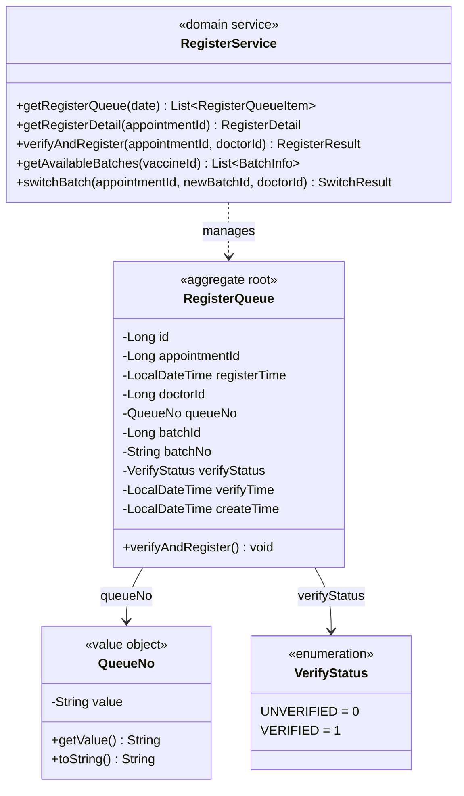

# 疫苗管理系统 — 登记上下文领域模型

**文档编号:** DOMAIN-REGISTER-001
**版本:** V1.1
**状态:** 正式发布
**日期:** 2026-04-02
**上游依赖:** REQ-REGISTER V1.0 / REQ-GLOBAL V1.0

---

## 目录

1. [上下文概述](#1-上下文概述)
2. [聚合设计](#2-聚合设计)
3. [实体详细定义](#3-实体详细定义)
4. [值对象定义](#4-值对象定义)
5. [领域服务](#5-领域服务)
6. [领域事件](#6-领域事件)
7. [仓储接口](#7-仓储接口)
8. [物理数据模型](#8-物理数据模型)
9. [与其他上下文的关系](#9-与其他上下文的关系)

---

## 1. 上下文概述

### 1.1 核心定位

Register Context 是连接预检和接种的桥梁上下文。负责信息核实、FEFO 批次分配与库存锁定、排队管理。

### 1.2 职责边界

| 职责 | 本上下文 | 其他上下文 |
|------|---------|-----------|
| 登记核实 | **负责** | — |
| FEFO 批次分配 | **负责** | — |
| 库存锁定（locked_stock+1） | **负责**（调用 Stock ACL） | Stock Context 执行 |
| 排队号生成 | **负责** | — |
| 批次切换 | **负责** | — |
| 状态 7→8 变更 | **负责**（协调 Appointment） | Appointment Context 存储 |

### 1.3 核心事务

登记+批次锁定是系统**最高并发热点**（事务 T5），必须在事务内使用 `SELECT FOR UPDATE` 保证数据一致性。

---

## 2. 聚合设计



### 2.1 聚合说明

| 项目 | 说明 |
|------|------|
| 聚合根 | `RegisterQueue` |
| 聚合内实体 | 无 |
| 聚合标识符 | `registerQueue.id` |
| 不变量 | 同一 appointment_id 只能有一条登记记录（UNIQUE约束） |
| 并发控制 | FEFO 分配时对 vaccine_batch 和 hospital_vaccine_stock 加行锁 |

---

## 3. 实体详细定义

### 3.1 RegisterQueue（登记排队记录）

| 字段 | 类型 | 约束 | 说明 |
|------|------|------|------|
| id | bigint | PK, auto_increment | 登记记录ID |
| appointment_id | bigint | UNIQUE, NOT NULL, FK → appointment.id | 预约ID（一对一） |
| register_time | datetime | NOT NULL | 登记时间 |
| doctor_id | bigint | NOT NULL, FK → sys_user.id | 登记医生ID |
| queue_no | varchar(10) | NOT NULL | 排队号，格式：A + 3位日序号 |
| batch_id | bigint | NOT NULL, FK → vaccine_batch.id | 分配的批次ID |
| batch_no | varchar(50) | NOT NULL | 批次号（冗余，方便查询） |
| verify_status | tinyint | NOT NULL, DEFAULT 0 | 核实状态（0=未核实, 1=已核实） |
| verify_time | datetime | NULL | 核实时间 |
| create_time | datetime | NOT NULL, DEFAULT CURRENT_TIMESTAMP | 创建时间 |

---

## 4. 值对象定义

### 4.1 QueueNo（排队号）

- 格式：`A` + 3位日序号（如 A001, A002, ..., A999）
- 每日重置，从 A001 开始递增
- 生成规则：查询当日最大 queue_no，+1

### 4.2 VerifyStatus（核实状态）

| 编码 | 枚举名 | 描述 |
|------|--------|------|
| 0 | UNVERIFIED | 未核实 |
| 1 | VERIFIED | 已核实 |

---

## 5. 领域服务

### 5.1 RegisterService

#### 5.1.1 verifyAndRegister — 核心登记事务（T5）

```java
/**
 * 核心登记事务 T5
 * 这是系统最高并发热点，必须在事务内使用 SELECT FOR UPDATE
 *
 * 事务范围：appointment + register_queue + hospital_vaccine_stock
 *
 * 步骤：
 * 1. 锁定预约行，校验 status=7
 * 2. 校验预检结果为 PASS
 * 3. FEFO 查询可用批次（加锁）
 * 4. 锁定库存（locked_stock +1）
 * 5. 生成排队号
 * 6. 保存登记记录
 * 7. 更新预约状态为 8
 */
@Transactional(rollbackFor = Exception.class, timeout = 30)
public RegisterResult verifyAndRegister(Long appointmentId, Long doctorId) {
    // 1. 锁定预约行
    Appointment appointment = appointmentRepository.findByIdForUpdate(appointmentId);
    if (appointment == null) {
        throw new BusinessException(2008, "预约不存在");
    }
    if (appointment.getStatus() != AppointmentStatus.PRECHECK_PASS.getCode()) {
        throw new BusinessException(5001, "当前状态不允许登记");
    }

    // 2. 校验预检结果
    PreCheckRecord preCheck = preCheckRepository.findByAppointmentId(appointmentId);
    if (preCheck == null || preCheck.getCheckResult() != CheckResult.PASS) {
        throw new BusinessException(5001, "预检未通过，不允许登记");
    }

    // 3. FEFO 查询可用批次（加锁，防并发分配同一批次）
    // 注意：hospitalId 从当前登录医生所属医院获取（Application Service 传入），不存储在 Appointment 中
    Long hospitalId = getCurrentHospitalId(doctorId);
    VaccineBatch batch = batchRepository.findAvailableForFEFO(
        appointment.getVaccineId(), hospitalId);
    if (batch == null) {
        throw new BusinessException(5002, "无可用批次（库存为0或全部过期）");
    }

    // 4. 锁定库存
    boolean locked = stockRepository.lockStock(batch.getId());
    if (!locked) {
        throw new BusinessException(5003, "库存锁定失败");
    }

    // 5. 生成排队号
    String queueNo = registerQueueRepository.generateQueueNo(LocalDate.now());

    // 6. 保存登记记录
    RegisterQueue queue = new RegisterQueue();
    queue.setAppointmentId(appointmentId);
    queue.setRegisterTime(LocalDateTime.now());
    queue.setDoctorId(doctorId);
    queue.setQueueNo(queueNo);
    queue.setBatchId(batch.getId());
    queue.setBatchNo(batch.getBatchNo());
    queue.setVerifyStatus(VerifyStatus.VERIFIED.getCode());
    queue.setVerifyTime(LocalDateTime.now());
    registerQueueRepository.save(queue);

    // 7. 更新预约状态
    appointment.setStatus(AppointmentStatus.REGISTERED.getCode());
    appointment.setBatchId(batch.getId());
    appointment.setCurrentWindow("REGISTER" + getDoctorWindowSuffix(doctorId));
    appointmentRepository.updateStatus(appointment);

    // 8. 发布事件
    eventBus.publish(new RegisteredEvent(
        appointmentId, batch.getId(), batch.getBatchNo(), queueNo, doctorId));

    return new RegisterResult(queue.getId(), queueNo, batch.getBatchNo());
}
```

#### 5.1.2 getAvailableBatches — FEFO 可用批次查询

```java
/**
 * 查询 FEFO 可用批次（不加锁，仅用于展示）
 */
public List<BatchInfo> getAvailableBatches(Long vaccineId) {
    return batchRepository.findAvailableBatches(vaccineId).stream()
        .map(b -> new BatchInfo(
            b.getId(), b.getBatchNo(), b.getExpiryDate(),
            b.getManufacturer(), b.getStatus(),
            stockRepository.getAvailableStock(b.getId())))
        .collect(Collectors.toList());
}
```

#### 5.1.3 switchBatch — 批次切换

```java
/**
 * 批次切换（仅在 status=8 且未接种时可操作）
 *
 * 事务：释放旧批次 locked_stock，锁定新批次 locked_stock
 */
@Transactional(rollbackFor = Exception.class, timeout = 30)
public SwitchResult switchBatch(Long appointmentId, Long newBatchId, Long doctorId) {
    // 1. 锁定预约行
    Appointment appointment = appointmentRepository.findByIdForUpdate(appointmentId);
    if (appointment.getStatus() != AppointmentStatus.REGISTERED.getCode()) {
        throw new BusinessException(5001, "仅已登记状态可切换批次");
    }

    Long oldBatchId = appointment.getBatchId();
    if (oldBatchId == null || oldBatchId.equals(newBatchId)) {
        throw new BusinessException(4007, "无效的批次切换");
    }

    // 2. 释放旧批次锁定
    stockRepository.releaseStock(oldBatchId);

    // 3. 锁定新批次
    boolean locked = stockRepository.lockStock(newBatchId);
    if (!locked) {
        // 回滚：重新锁定旧批次
        stockRepository.lockStock(oldBatchId);
        throw new BusinessException(5002, "目标批次库存不足");
    }

    // 4. 更新登记记录
    RegisterQueue queue = registerQueueRepository.findByAppointmentId(appointmentId);
    VaccineBatch newBatch = batchRepository.findById(newBatchId);
    queue.setBatchId(newBatchId);
    queue.setBatchNo(newBatch.getBatchNo());
    registerQueueRepository.update(queue);

    // 5. 更新预约批次
    appointment.setBatchId(newBatchId);
    appointmentRepository.updateBatch(appointment);

    eventBus.publish(new BatchSwitchedEvent(appointmentId, oldBatchId, newBatchId));

    return new SwitchResult(oldBatchId, newBatchId, newBatch.getBatchNo());
}
```

#### 5.1.4 重试策略

| 操作 | 最大重试次数 | 重试间隔 | 退避策略 |
|------|-------------|---------|---------|
| FEFO 批次分配+锁定 | 3 | 100ms, 200ms, 400ms | 指数退避 |
| 排队号生成 | 1 | 即时 | 不重试（事务内 UNIQUE 约束已保证） |
| 批次切换 | 1 | 即时 | 不重试 |

---

## 6. 领域事件

| 事件名 | 触发时机 | 携带数据 | 消费者 |
|--------|---------|---------|--------|
| `RegisteredEvent` | 登记完成 | appointmentId, batchId, batchNo, queueNo, doctorId | — |
| `BatchSwitchedEvent` | 批次切换 | appointmentId, oldBatchId, newBatchId | — |

---

## 7. 仓储接口

```java
public interface RegisterQueueRepository {
    RegisterQueue findByAppointmentId(Long appointmentId);
    void save(RegisterQueue registerQueue);
    void update(RegisterQueue registerQueue);
    String generateQueueNo(LocalDate date);
}
```

---

## 8. 物理数据模型

### 8.1 ER 关系图

```mermaid
erDiagram
    REGISTER_QUEUE {
        bigint id PK
        bigint appointment_id UK_FK "预约ID"
        datetime register_time "登记时间"
        bigint doctor_id FK "登记医生"
        varchar queue_no "排队号(A+3seq)"
        bigint batch_id FK "批次ID"
        varchar batch_no "批次号"
        tinyint verify_status "核实状态"
        datetime verify_time "核实时间"
        datetime create_time
    }

    APPOINTMENT ||--o| REGISTER_QUEUE : "1:1"
    SYS_USER ||--o{ REGISTER_QUEUE : "1:N"
    VACCINE_BATCH ||--o{ REGISTER_QUEUE : "1:N"
```

### 8.2 DDL

```sql
-- ============================================================
-- 登记排队记录表
-- 所属上下文: Register Context
-- ============================================================
CREATE TABLE `register_queue` (
    `id`              BIGINT       NOT NULL AUTO_INCREMENT COMMENT '登记记录ID',
    `appointment_id`  BIGINT       NOT NULL                COMMENT '预约ID（一对一）',
    `register_time`   DATETIME     NOT NULL                COMMENT '登记时间',
    `doctor_id`       BIGINT       NOT NULL                COMMENT '登记医生ID',
    `queue_no`        VARCHAR(10)  NOT NULL                COMMENT '排队号（A+3位日序号）',
    `batch_id`        BIGINT       NOT NULL                COMMENT '分配的批次ID',
    `batch_no`        VARCHAR(50)  NOT NULL                COMMENT '批次号（冗余）',
    `verify_status`   TINYINT      NOT NULL DEFAULT 0      COMMENT '核实状态（0未核实/1已核实）',
    `verify_time`     DATETIME     NULL                    COMMENT '核实时间',
    `create_time`     DATETIME     NOT NULL DEFAULT CURRENT_TIMESTAMP COMMENT '创建时间',
    `update_time`     DATETIME     NOT NULL DEFAULT CURRENT_TIMESTAMP ON UPDATE CURRENT_TIMESTAMP COMMENT '更新时间',
    PRIMARY KEY (`id`),
    UNIQUE KEY `uk_appointment_id` (`appointment_id`),
    KEY `idx_batch_id` (`batch_id`),
    KEY `idx_doctor_id` (`doctor_id`),
    KEY `idx_register_time` (`register_time`)
) ENGINE=InnoDB DEFAULT CHARSET=utf8mb4 COLLATE=utf8mb4_general_ci COMMENT='登记排队记录表';
```

---

## 9. 与其他上下文的关系

### 9.1 依赖关系

| 依赖 | 交互方式 | 用途 |
|------|---------|------|
| Appointment Context | Repository（读+写） | 读取/更新预约状态 |
| Stock Context | Anti-Corruption Layer | FEFO 批次查询 + 库存锁定 |
| Flow Context | Repository（只读） | 校验预检结果 |
| Identity Context | Repository（只读） | 查询医生信息 |

### 9.2 FEFO SQL（通过 ACL 调用 Stock Context）

```sql
-- FEFO 可用批次查询（加锁）
SELECT b.id, b.batch_no, b.expiry_date, b.manufacturer,
       s.available_stock, s.locked_stock
FROM vaccine_batch b
JOIN hospital_vaccine_stock s ON b.id = s.batch_id
WHERE b.vaccine_id = #{vaccineId}
  AND s.hospital_id = #{hospitalId}
  AND b.status = 0            -- 仅正常状态（临期和过期不可分配）
  AND s.available_stock > s.locked_stock  -- 有可预约库存（available - locked > 0）
  AND b.expiry_date > NOW()        -- 未过期
ORDER BY b.expiry_date ASC         -- 先过期先出
LIMIT 1
FOR UPDATE;                         -- 行锁防并发
```

---

## 版本历史

| 版本 | 日期 | 变更说明 |
|------|------|----------|
| V1.0 | 2026-04-02 | 初始版本，基于 REQ-REGISTER V1.0 生成 |
| V1.1 | 2026-04-03 | REQ-DOMAIN 一致性评审修复（P3：register_queue 补充 update_time，排队号重试改为不重试） |

---

**文档结束**
