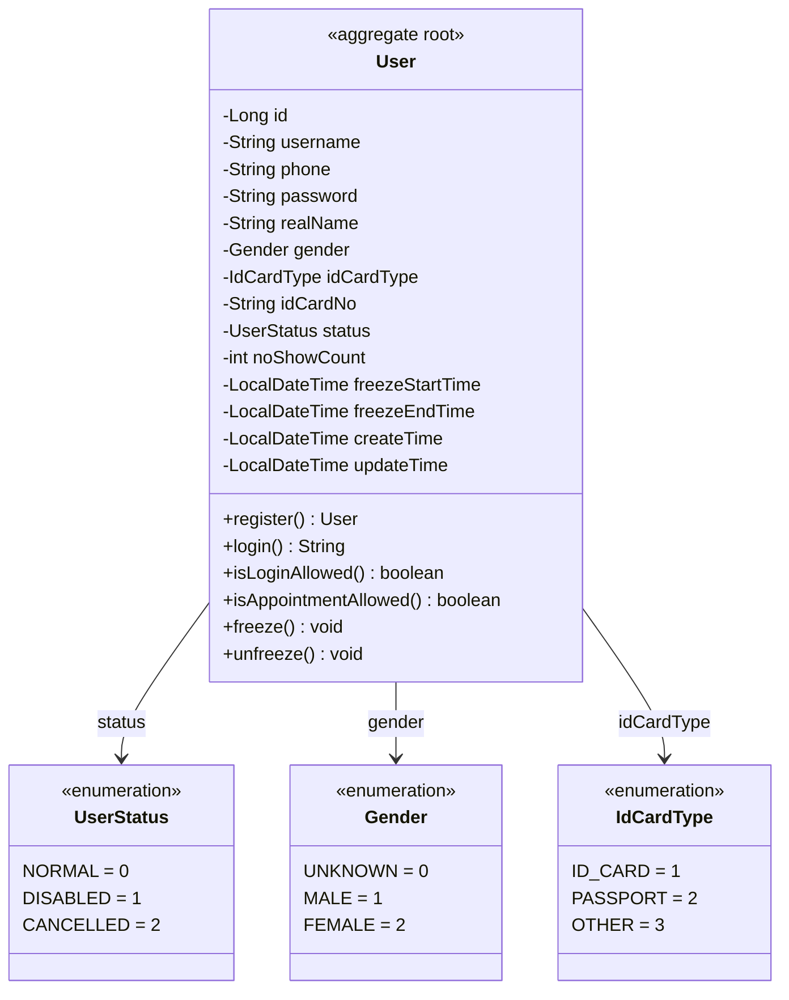
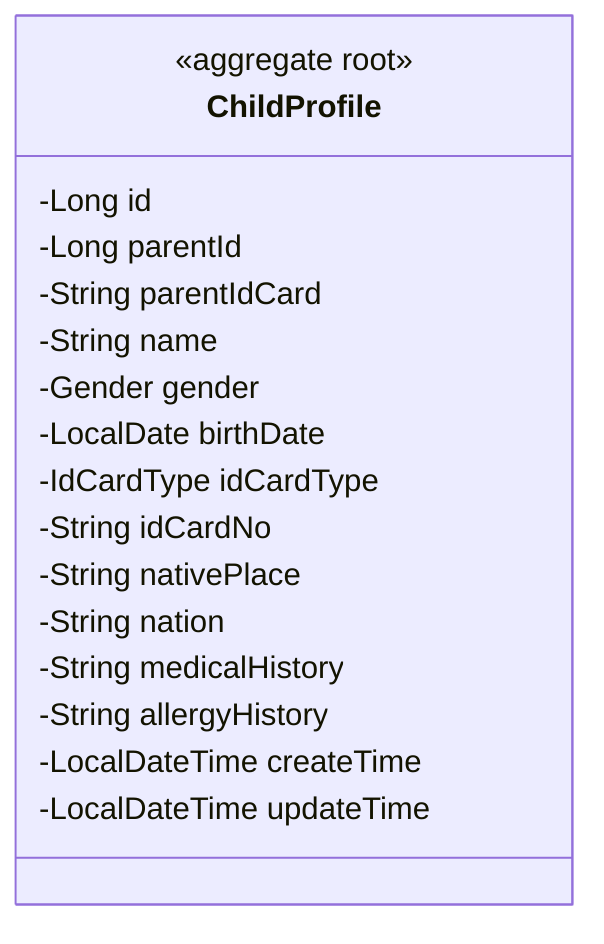
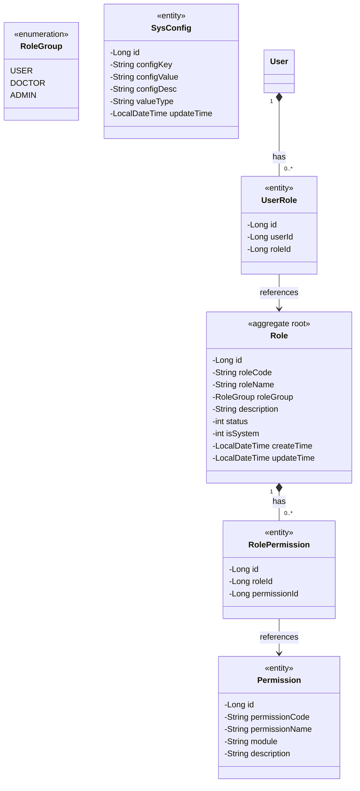

# 疫苗管理系统 — 身份认证上下文领域模型

**文档编号:** DOMAIN-IDENTITY-001
**版本:** V1.1
**状态:** 正式发布
**日期:** 2026-04-02
**上游依赖:** REQ-USER V1.0 / REQ-ADMIN V1.0 / REQ-GLOBAL V1.0

---

## 目录

1. [上下文概述](#1-上下文概述)
2. [聚合设计](#2-聚合设计)
3. [实体详细定义](#3-实体详细定义)
4. [值对象定义](#4-值对象定义)
5. [领域服务](#5-领域服务)
6. [领域事件](#6-领域事件)
7. [仓储接口](#7-仓储接口)
8. [物理数据模型](#8-物理数据模型)
9. [与其他上下文的关系](#9-与其他上下文的关系)
10. [预置数据](#10-预置数据)

---

## 1. 上下文概述

### 1.1 核心定位

Identity Context 是系统的**基础上下文**。合并了 REQ-USER（用户模块）和 REQ-ADMIN（管理模块），因为它们共享 `User` 实体和 RBAC 权限模型。

### 1.2 职责边界

| 职责 | 说明 |
|------|------|
| 用户认证 | 注册、登录、登出、密码管理 |
| RBAC 权限 | 角色、权限、用户-角色分配 |
| 儿童档案 | 儿童档案 CRUD |
| 用户管理 | 冻结/解冻、状态管理 |
| 系统配置 | 全局配置项管理 |

### 1.3 双重冻结机制

| 冻结类型 | 触发条件 | 影响 | 实现 |
|---------|---------|------|------|
| **管理员冻结** | 管理员手动冻结 | 阻止登录 + 阻止预约 | `status=1` (DISABLED) |
| **爽约冻结** | no_show_count >= 3 | 仅阻止预约，不阻止登录 | `freeze_end_time > NOW()` |

---

## 2. 聚合设计

### 2.1 聚合 1：User（用户）



### 2.2 聚合 2：ChildProfile（儿童档案）



### 2.3 聚合 3：Role（角色）



---

## 3. 实体详细定义

### 3.1 User（系统用户）

| 字段 | 类型 | 约束 | 说明 |
|------|------|------|------|
| id | bigint | PK, auto_increment | 用户ID |
| username | varchar(50) | UNIQUE, NOT NULL | 用户名 |
| phone | varchar(20) | UNIQUE, NOT NULL | 手机号 |
| password | varchar(255) | NOT NULL | 密码（BCrypt加密） |
| real_name | varchar(50) | NULL | 真实姓名 |
| gender | tinyint | DEFAULT 0 | 性别（0未知/1男/2女） |
| id_card_type | tinyint | DEFAULT 1 | 证件类型 |
| id_card_no | varchar(30) | NULL | 证件号码 |
| status | tinyint | NOT NULL, DEFAULT 0 | 状态（0正常/1已禁用/2已注销） |
| no_show_count | int | NOT NULL, DEFAULT 0 | 爽约次数（累加不重置） |
| freeze_start_time | datetime | NULL | 爽约冻结开始时间 |
| freeze_end_time | datetime | NULL | 爽约冻结结束时间 |
| create_time | datetime | NOT NULL, DEFAULT CURRENT_TIMESTAMP | 创建时间 |
| update_time | datetime | NOT NULL, DEFAULT CURRENT_TIMESTAMP ON UPDATE | 更新时间 |

### 3.2 ChildProfile（儿童档案）

| 字段 | 类型 | 约束 | 说明 |
|------|------|------|------|
| id | bigint | PK, auto_increment | 儿童档案ID |
| parent_id | bigint | NOT NULL, FK → sys_user.id | 家长ID |
| parent_id_card | varchar(30) | NULL | 家长证件号（同步自User） |
| name | varchar(50) | NOT NULL | 儿童姓名 |
| gender | tinyint | NOT NULL | 性别（1男/2女） |
| birth_date | date | NOT NULL | 出生日期 |
| id_card_type | tinyint | DEFAULT 1 | 证件类型 |
| id_card_no | varchar(30) | NULL | 证件号码 |
| native_place | varchar(100) | NULL | 籍贯 |
| nation | varchar(30) | NULL | 民族 |
| medical_history | text | NULL | 疾病史 |
| allergy_history | text | NULL | 过敏史 |
| create_time | datetime | NOT NULL, DEFAULT CURRENT_TIMESTAMP | 创建时间 |
| update_time | datetime | NOT NULL, DEFAULT CURRENT_TIMESTAMP ON UPDATE | 更新时间 |

**约束：** 同一用户最多 5 个儿童档案。

### 3.3 Role（角色）

| 字段 | 类型 | 约束 | 说明 |
|------|------|------|------|
| id | bigint | PK, auto_increment | 角色ID |
| role_code | varchar(50) | UNIQUE, NOT NULL | 角色编码 |
| role_name | varchar(100) | NOT NULL | 角色名称 |
| role_group | varchar(20) | NOT NULL | 角色分组（USER/DOCTOR/ADMIN） |
| description | varchar(500) | NULL | 角色描述 |
| status | tinyint | NOT NULL, DEFAULT 0 | 状态（0启用/1禁用） |
| is_system | tinyint | NOT NULL, DEFAULT 0 | 是否系统内置（0自定义/1内置） |
| create_time | datetime | NOT NULL, DEFAULT CURRENT_TIMESTAMP | 创建时间 |
| update_time | datetime | NOT NULL, DEFAULT CURRENT_TIMESTAMP ON UPDATE | 更新时间 |

### 3.4 Permission（权限）

| 字段 | 类型 | 约束 | 说明 |
|------|------|------|------|
| id | bigint | PK, auto_increment | 权限ID |
| permission_code | varchar(100) | UNIQUE, NOT NULL | 权限编码 |
| permission_name | varchar(100) | NOT NULL | 权限名称 |
| module | varchar(50) | NOT NULL | 所属模块 |
| description | varchar(200) | NULL | 权限描述 |

### 3.5 SysConfig（系统配置）

| 字段 | 类型 | 约束 | 说明 |
|------|------|------|------|
| id | bigint | PK, auto_increment | 配置ID |
| config_key | varchar(100) | UNIQUE, NOT NULL | 配置键 |
| config_value | varchar(500) | NOT NULL | 配置值 |
| config_desc | varchar(500) | NULL | 配置描述 |
| value_type | varchar(20) | NOT NULL, DEFAULT 'STRING' | 值类型（INT/STRING/BOOLEAN） |
| update_time | datetime | NOT NULL | 更新时间 |

---

## 4. 值对象定义

| 值对象 | 枚举值 | 说明 |
|--------|--------|------|
| UserStatus | NORMAL(0), DISABLED(1), CANCELLED(2) | 用户状态 |
| Gender | UNKNOWN(0), MALE(1), FEMALE(2) | 性别 |
| IdCardType | ID_CARD(1), PASSPORT(2), OTHER(3) | 证件类型 |
| RoleGroup | USER, DOCTOR, ADMIN | 角色分组 |

---

## 5. 领域服务

### 5.1 AuthService

| 方法 | 说明 | 关键规则 |
|------|------|---------|
| register(phone, smsCode, password, realName) | 用户注册 | 手机号唯一，密码6-20位含字母+数字，BCrypt加密，realName 必填 |
| login(phone, password) | 用户登录 | 检查status≠DISABLED/CANCELLED，5次失败锁定30分钟 |
| logout(userId) | 登出 | 清除Token |
| changePassword(userId, oldPwd, newPwd) | 修改密码 | 验证旧密码 |
| resetPassword(phone, smsCode, newPwd) | 重置密码 | SMS验证码校验；重置成功后清除登录失败锁定计数（DEL login_fail:{phone}） |

### 5.2 FreezeService

| 方法 | 说明 |
|------|------|
| freezeUser(userId, reason) | 管理员冻结：前置校验 status != CANCELLED（已注销用户不可冻结）；执行 status=1，阻止登录+预约；后置：发布 UserFrozenEvent 事件，由审计日志处理器写入 sys_permission_audit |
| unfreezeUser(userId) | 管理员解冻：status=0；后置：发布 UserUnfrozenEvent 事件 |
| checkNoShowFreeze(userId) | 爽约冻结检查：freeze_end_time > NOW() |
| incrementNoShowCount(userId) | 爽约计数+1，>=3时触发7天冻结。若当前已处于冻结期，则冻结截止时间从当前时间起延长7天（而非重置） |

### 5.3 ChildProfileService

| 方法 | 说明 |
|------|------|
| getChildren(userId) | 获取儿童列表 |
| getChild(userId, childId) | 获取儿童详情（归属校验） |
| addChild(userId, data) | 添加儿童（上限5个） |
| updateChild(userId, childId, data) | 修改儿童（归属校验） |
| deleteChild(userId, childId) | 删除儿童（归属校验+无进行中预约） |
| syncParentIdCard(userId, newIdCardNo) | 同步家长证件号到所有儿童 |

### 5.4 RbacService

| 方法 | 说明 | 规则 |
|------|------|------|
| getRoles() | 角色列表 | — |
| createRole(data) | 创建角色 | SUPER_ADMIN only，非系统角色 |
| updateRole(roleId, data) | 修改角色 | SUPER_ADMIN only，非系统角色 |
| deleteRole(roleId) | 删除角色 | 非系统角色 + 无绑定用户 |
| assignRolePermissions(roleId, codes) | 分配权限 | 全量覆盖 |
| assignUserRoles(userId, roleIds) | 分配用户角色 | SUPER_ADMIN无限制，BUSINESS_ADMIN仅DOCTOR组 |
| getUserPermissions(userId) | 获取用户权限 | Redis → DB → 返回 |
| getConfig(key) | 获取配置 | Redis → sys_config → 默认值 |
| updateConfig(key, value) | 修改配置 | SUPER_ADMIN only |

### 5.5 权限缓存策略

```
读取优先级：
Redis (user:permissions:{userId}, TTL=30min)
    → sys_role_permission + sys_user_role
    → 返回

写入/失效：
分配角色/权限时 → 删除对应Redis key
```

---

## 6. 领域事件

| 事件名 | 触发时机 |
|--------|---------|
| UserRegisteredEvent(userId, phone) | 用户注册 |
| UserFrozenEvent(userId, reason) | 用户冻结 |
| UserUnfrozenEvent(userId) | 用户解冻 |
| RoleAssignedEvent(userId, roleId) | 角色分配 |
| PermissionChangedEvent(roleId, permissionCodes) | 权限变更 |

---

## 7. 仓储接口

```java
public interface UserRepository {
    Optional<User> findById(Long id);
    Optional<User> findByPhone(String phone);
    Optional<User> findByUsername(String username);
    void save(User user);
    void updateStatus(User user);
    void incrementNoShowCount(Long userId);
    void freezeForNoShow(Long userId, int days);
}

public interface ChildProfileRepository {
    Optional<ChildProfile> findById(Long id);
    List<ChildProfile> findByParentId(Long parentId);
    int countByParentId(Long parentId);
    void save(ChildProfile child);
    void update(ChildProfile child);
    void deleteById(Long id);
    int countInProgressAppointments(Long childId);
}

public interface RoleRepository {
    Optional<Role> findById(Long id);
    Optional<Role> findByRoleCode(String roleCode);
    List<Role> findAll();
    void save(Role role);
    void update(Role role);
    void deleteById(Long id);
    boolean existsByRoleCode(String roleCode);
    int countUsersByRoleId(Long roleId);
}

public interface PermissionRepository {
    Optional<Permission> findById(Long id);
    Optional<Permission> findByPermissionCode(String code);
    List<Permission> findAll();
    List<Permission> findByRoleId(Long roleId);
}

public interface UserRoleRepository {
    List<UserRole> findByUserId(Long userId);
    void deleteByUserId(Long userId);
    void saveAll(List<UserRole> userRoles);
}

public interface RolePermissionRepository {
    List<RolePermission> findByRoleId(Long roleId);
    void deleteByRoleId(Long roleId);
    void saveAll(List<RolePermission> rolePermissions);
}

public interface ConfigRepository {
    Optional<SysConfig> findByConfigKey(String key);
    List<SysConfig> findAll();
    void save(SysConfig config);
    void update(SysConfig config);
}
```

---

## 8. 物理数据模型

### 8.1 DDL

```sql
-- ============================================================
-- 系统用户表
-- 所属上下文: Identity Context
-- ============================================================
CREATE TABLE `sys_user` (
    `id`               BIGINT       NOT NULL AUTO_INCREMENT COMMENT '用户ID',
    `username`         VARCHAR(50)  NOT NULL                COMMENT '用户名',
    `phone`            VARCHAR(20)  NOT NULL                COMMENT '手机号',
    `password`         VARCHAR(255) NOT NULL                COMMENT '密码（BCrypt加密）',
    `real_name`        VARCHAR(50)  NULL                    COMMENT '真实姓名',
    `gender`           TINYINT      NOT NULL DEFAULT 0      COMMENT '性别（0未知/1男/2女）',
    `id_card_type`     TINYINT      NOT NULL DEFAULT 1      COMMENT '证件类型（1身份证/2护照/3其他）',
    `id_card_no`       VARCHAR(30)  NULL                    COMMENT '证件号码',
    `status`           TINYINT      NOT NULL DEFAULT 0      COMMENT '状态（0正常/1已禁用/2已注销）',
    `no_show_count`    INT          NOT NULL DEFAULT 0      COMMENT '爽约次数',
    `freeze_start_time` DATETIME     NULL                    COMMENT '爽约冻结开始时间',
    `freeze_end_time`  DATETIME     NULL                    COMMENT '爽约冻结结束时间',
    `create_time`      DATETIME     NOT NULL DEFAULT CURRENT_TIMESTAMP COMMENT '创建时间',
    `update_time`      DATETIME     NOT NULL DEFAULT CURRENT_TIMESTAMP ON UPDATE CURRENT_TIMESTAMP COMMENT '更新时间',
    PRIMARY KEY (`id`),
    UNIQUE KEY `uk_username` (`username`),
    UNIQUE KEY `uk_phone` (`phone`),
    KEY `idx_status` (`status`)
) ENGINE=InnoDB DEFAULT CHARSET=utf8mb4 COLLATE=utf8mb4_general_ci COMMENT='系统用户表';

-- ============================================================
-- 儿童档案表
-- 所属上下文: Identity Context
-- ============================================================
CREATE TABLE `child_profile` (
    `id`               BIGINT       NOT NULL AUTO_INCREMENT COMMENT '儿童档案ID',
    `parent_id`        BIGINT       NOT NULL                COMMENT '家长ID',
    `parent_id_card`   VARCHAR(30)  NULL                    COMMENT '家长证件号（同步自User）',
    `name`             VARCHAR(50)  NOT NULL                COMMENT '儿童姓名',
    `gender`           TINYINT      NOT NULL                COMMENT '性别（1男/2女）',
    `birth_date`       DATE         NOT NULL                COMMENT '出生日期',
    `id_card_type`     TINYINT      NOT NULL DEFAULT 1      COMMENT '证件类型',
    `id_card_no`       VARCHAR(30)  NULL                    COMMENT '证件号码',
    `native_place`     VARCHAR(100) NULL                    COMMENT '籍贯',
    `nation`           VARCHAR(30)  NULL                    COMMENT '民族',
    `medical_history`  TEXT         NULL                    COMMENT '疾病史',
    `allergy_history`  TEXT         NULL                    COMMENT '过敏史',
    `create_time`      DATETIME     NOT NULL DEFAULT CURRENT_TIMESTAMP COMMENT '创建时间',
    `update_time`      DATETIME     NOT NULL DEFAULT CURRENT_TIMESTAMP ON UPDATE CURRENT_TIMESTAMP COMMENT '更新时间',
    PRIMARY KEY (`id`),
    KEY `idx_parent_id` (`parent_id`),
    KEY `idx_parent_id_card` (`parent_id_card`),
    KEY `idx_name` (`name`)
) ENGINE=InnoDB DEFAULT CHARSET=utf8mb4 COLLATE=utf8mb4_general_ci COMMENT='儿童档案表';

-- ============================================================
-- 系统角色表
-- 所属上下文: Identity Context
-- ============================================================
CREATE TABLE `sys_role` (
    `id`            BIGINT       NOT NULL AUTO_INCREMENT COMMENT '角色ID',
    `role_code`     VARCHAR(50)  NOT NULL                COMMENT '角色编码',
    `role_name`     VARCHAR(100) NOT NULL                COMMENT '角色名称',
    `role_group`    VARCHAR(20)  NOT NULL                COMMENT '角色分组（USER/DOCTOR/ADMIN）',
    `description`   VARCHAR(500) NULL                    COMMENT '角色描述',
    `status`        TINYINT      NOT NULL DEFAULT 0      COMMENT '状态（0启用/1禁用）',
    `is_system`     TINYINT      NOT NULL DEFAULT 0      COMMENT '是否系统内置（0自定义/1内置）',
    `create_time`   DATETIME     NOT NULL DEFAULT CURRENT_TIMESTAMP COMMENT '创建时间',
    `update_time`   DATETIME     NOT NULL DEFAULT CURRENT_TIMESTAMP ON UPDATE CURRENT_TIMESTAMP COMMENT '更新时间',
    PRIMARY KEY (`id`),
    UNIQUE KEY `uk_role_code` (`role_code`),
    KEY `idx_role_group` (`role_group`)
) ENGINE=InnoDB DEFAULT CHARSET=utf8mb4 COLLATE=utf8mb4_general_ci COMMENT='系统角色表';

-- ============================================================
-- 系统权限表
-- 所属上下文: Identity Context
-- ============================================================
CREATE TABLE `sys_permission` (
    `id`               BIGINT       NOT NULL AUTO_INCREMENT COMMENT '权限ID',
    `permission_code`  VARCHAR(100) NOT NULL                COMMENT '权限编码',
    `permission_name`  VARCHAR(100) NOT NULL                COMMENT '权限名称',
    `module`           VARCHAR(50)  NOT NULL                COMMENT '所属模块',
    `description`      VARCHAR(200) NULL                    COMMENT '权限描述',
    `create_time`      DATETIME     NOT NULL DEFAULT CURRENT_TIMESTAMP COMMENT '创建时间',
    PRIMARY KEY (`id`),
    UNIQUE KEY `uk_permission_code` (`permission_code`),
    KEY `idx_module` (`module`)
) ENGINE=InnoDB DEFAULT CHARSET=utf8mb4 COLLATE=utf8mb4_general_ci COMMENT='系统权限表';

-- ============================================================
-- 用户角色关联表
-- 所属上下文: Identity Context
-- ============================================================
CREATE TABLE `sys_user_role` (
    `id`          BIGINT  NOT NULL AUTO_INCREMENT COMMENT 'ID',
    `user_id`     BIGINT  NOT NULL                COMMENT '用户ID',
    `role_id`     BIGINT  NOT NULL                COMMENT '角色ID',
    `create_time` DATETIME NOT NULL DEFAULT CURRENT_TIMESTAMP COMMENT '创建时间',
    PRIMARY KEY (`id`),
    UNIQUE KEY `uk_user_role` (`user_id`, `role_id`),
    KEY `idx_role_id` (`role_id`)
) ENGINE=InnoDB DEFAULT CHARSET=utf8mb4 COLLATE=utf8mb4_general_ci COMMENT='用户角色关联表';

-- ============================================================
-- 角色权限关联表
-- 所属上下文: Identity Context
-- ============================================================
CREATE TABLE `sys_role_permission` (
    `id`            BIGINT  NOT NULL AUTO_INCREMENT COMMENT 'ID',
    `role_id`       BIGINT  NOT NULL                COMMENT '角色ID',
    `permission_id` BIGINT  NOT NULL                COMMENT '权限ID',
    `create_time`   DATETIME NOT NULL DEFAULT CURRENT_TIMESTAMP COMMENT '创建时间',
    PRIMARY KEY (`id`),
    UNIQUE KEY `uk_role_permission` (`role_id`, `permission_id`),
    KEY `idx_permission_id` (`permission_id`)
) ENGINE=InnoDB DEFAULT CHARSET=utf8mb4 COLLATE=utf8mb4_general_ci COMMENT='角色权限关联表';

-- ============================================================
-- 系统配置表
-- 所属上下文: Identity Context
-- ============================================================
CREATE TABLE `sys_config` (
    `id`           BIGINT       NOT NULL AUTO_INCREMENT COMMENT '配置ID',
    `config_key`   VARCHAR(100) NOT NULL                COMMENT '配置键',
    `config_value` VARCHAR(500) NOT NULL                COMMENT '配置值',
    `config_desc`  VARCHAR(500) NULL                    COMMENT '配置描述',
    `value_type`   VARCHAR(20)  NOT NULL DEFAULT 'STRING' COMMENT '值类型（INT/STRING/BOOLEAN）',
    `update_time`  DATETIME     NOT NULL DEFAULT CURRENT_TIMESTAMP ON UPDATE CURRENT_TIMESTAMP COMMENT '更新时间',
    PRIMARY KEY (`id`),
    UNIQUE KEY `uk_config_key` (`config_key`)
) ENGINE=InnoDB DEFAULT CHARSET=utf8mb4 COLLATE=utf8mb4_general_ci COMMENT='系统配置表';

-- ============================================================
-- 短信验证码表（外部短信服务依赖）
-- 所属上下文: Identity Context
-- ============================================================
CREATE TABLE `sms_verification` (
    `id`           BIGINT       NOT NULL AUTO_INCREMENT COMMENT '验证码ID',
    `phone`        VARCHAR(20)  NOT NULL                COMMENT '手机号',
    `code`         VARCHAR(10)  NOT NULL                COMMENT '验证码（6位数字）',
    `expire_time`  DATETIME     NOT NULL                COMMENT '过期时间（通常5分钟）',
    `used`         TINYINT      NOT NULL DEFAULT 0      COMMENT '是否已使用（0否/1是）',
    `create_time`  DATETIME     NOT NULL DEFAULT CURRENT_TIMESTAMP COMMENT '创建时间',
    PRIMARY KEY (`id`),
    KEY `idx_phone` (`phone`)
) ENGINE=InnoDB DEFAULT CHARSET=utf8mb4 COLLATE=utf8mb4_general_ci COMMENT='短信验证码表';

-- ============================================================
-- 权限操作审计日志表
-- 所属上下文: Identity Context
-- ============================================================
CREATE TABLE `sys_permission_audit` (
    `id`           BIGINT       NOT NULL AUTO_INCREMENT COMMENT '审计日志ID',
    `user_id`      BIGINT       NOT NULL                COMMENT '操作人ID',
    `target_type`  VARCHAR(50)  NOT NULL                COMMENT '操作对象类型（USER/ROLE/PERMISSION）',
    `target_id`    BIGINT       NOT NULL                COMMENT '操作对象ID',
    `action`       VARCHAR(50)  NOT NULL                COMMENT '操作类型（FREEZE/UNFREEZE/ASSIGN_ROLE等）',
    `detail`       VARCHAR(500) NULL                    COMMENT '操作详情',
    `create_time`  DATETIME     NOT NULL DEFAULT CURRENT_TIMESTAMP COMMENT '创建时间',
    PRIMARY KEY (`id`),
    KEY `idx_user_id` (`user_id`),
    KEY `idx_target` (`target_type`, `target_id`)
) ENGINE=InnoDB DEFAULT CHARSET=utf8mb4 COLLATE=utf8mb4_general_ci COMMENT='权限操作审计日志表';

-- ============================================================
-- 用户直接权限表（补充角色权限机制）
-- 所属上下文: Identity Context
-- 说明：用户直接权限与角色权限做 UNION，用于特殊权限授予
-- ============================================================
CREATE TABLE `sys_user_permission` (
    `id`              BIGINT  NOT NULL AUTO_INCREMENT COMMENT 'ID',
    `user_id`         BIGINT  NOT NULL                COMMENT '用户ID',
    `permission_id`   BIGINT  NOT NULL                COMMENT '权限ID',
    PRIMARY KEY (`id`),
    UNIQUE KEY `uk_user_permission` (`user_id`, `permission_id`),
    KEY `idx_permission_id` (`permission_id`)
) ENGINE=InnoDB DEFAULT CHARSET=utf8mb4 COLLATE=utf8mb4_general_ci COMMENT='用户直接权限表';

-- ============================================================
-- 窗口配置表
-- 所属上下文: Identity Context（管理模块）
-- 说明：定义接种点的各个窗口及其职能，Flow Context 只读引用
-- ============================================================
CREATE TABLE `hospital_window` (
    `id`                BIGINT       NOT NULL AUTO_INCREMENT COMMENT '窗口ID',
    `window_code`       VARCHAR(30)  NOT NULL                COMMENT '窗口编码（如 SIGNIN_01, PRECHECK_01）',
    `window_name`       VARCHAR(50)  NOT NULL                COMMENT '窗口名称（如 签到窗口1, 预检窗口1）',
    `window_function_type` VARCHAR(30) NOT NULL               COMMENT '窗口职能类型（SIGNIN/PRECHECK/REGISTER/VACCINATE/OBSERVE）',
    `status`            TINYINT      NOT NULL DEFAULT 0      COMMENT '状态（0启用/1禁用）',
    `capacity`          INT          NOT NULL DEFAULT 1      COMMENT '窗口容量（同时处理人数）',
    `avg_handle_time`   INT          NOT NULL DEFAULT 5      COMMENT '平均处理时长（分钟）',
    `sort_order`        INT          NOT NULL DEFAULT 0      COMMENT '排序序号',
    `create_time`       DATETIME     NOT NULL DEFAULT CURRENT_TIMESTAMP COMMENT '创建时间',
    `update_time`       DATETIME     NOT NULL DEFAULT CURRENT_TIMESTAMP ON UPDATE CURRENT_TIMESTAMP COMMENT '更新时间',
    PRIMARY KEY (`id`),
    UNIQUE KEY `uk_window_code` (`window_code`),
    KEY `idx_function_type` (`window_function_type`),
    KEY `idx_status` (`status`)
) ENGINE=InnoDB DEFAULT CHARSET=utf8mb4 COLLATE=utf8mb4_general_ci COMMENT='窗口配置表';

-- ============================================================
-- 医生排班表
-- 所属上下文: Identity Context（管理模块）
-- 说明：管理各窗口的医生排班，用于预约容量计算和窗口指引
-- ============================================================
CREATE TABLE `doctor_schedule` (
    `id`                BIGINT       NOT NULL AUTO_INCREMENT COMMENT '排班ID',
    `doctor_id`         BIGINT       NOT NULL                COMMENT '医生ID',
    `window_id`         BIGINT       NOT NULL                COMMENT '窗口ID',
    `schedule_date`     DATE         NOT NULL                COMMENT '排班日期',
    `time_slot`         VARCHAR(10)  NOT NULL                COMMENT '排班时段（AM/PM）',
    `status`            TINYINT      NOT NULL DEFAULT 0      COMMENT '状态（0正常/1请假/2取消）',
    `max_capacity`      INT          NOT NULL DEFAULT 50     COMMENT '最大接待量',
    `create_time`       DATETIME     NOT NULL DEFAULT CURRENT_TIMESTAMP COMMENT '创建时间',
    `update_time`       DATETIME     NOT NULL DEFAULT CURRENT_TIMESTAMP ON UPDATE CURRENT_TIMESTAMP COMMENT '更新时间',
    PRIMARY KEY (`id`),
    UNIQUE KEY `uk_doctor_window_date_slot` (`doctor_id`, `window_id`, `schedule_date`, `time_slot`),
    KEY `idx_doctor_id` (`doctor_id`),
    KEY `idx_schedule_date` (`schedule_date`),
    KEY `idx_window_id` (`window_id`)
) ENGINE=InnoDB DEFAULT CHARSET=utf8mb4 COLLATE=utf8mb4_general_ci COMMENT='医生排班表';

-- ============================================================
-- 系统公告表
-- 所属上下文: Identity Context（管理模块）
-- ============================================================
CREATE TABLE `system_notice` (
    `id`                BIGINT       NOT NULL AUTO_INCREMENT COMMENT '公告ID',
    `title`             VARCHAR(200) NOT NULL                COMMENT '公告标题',
    `content`           TEXT         NOT NULL                COMMENT '公告内容',
    `notice_type`       VARCHAR(20)  NOT NULL DEFAULT 'NORMAL' COMMENT '公告类型（NORMAL/URGENT/SYSTEM）',
    `status`            TINYINT      NOT NULL DEFAULT 0      COMMENT '状态（0待审核/1已发布/2已下架/3已拒绝）',
    `author_id`         BIGINT       NOT NULL                COMMENT '发布人ID',
    `audit_user_id`     BIGINT       NULL                    COMMENT '审核人ID',
    `audit_time`        DATETIME     NULL                    COMMENT '审核时间',
    `audit_reason`      VARCHAR(500) NULL                    COMMENT '审核意见',
    `publish_time`      DATETIME     NULL                    COMMENT '发布时间',
    `start_time`        DATETIME     NULL                    COMMENT '展示开始时间',
    `end_time`          DATETIME     NULL                    COMMENT '展示结束时间',
    `create_time`       DATETIME     NOT NULL DEFAULT CURRENT_TIMESTAMP COMMENT '创建时间',
    `update_time`       DATETIME     NOT NULL DEFAULT CURRENT_TIMESTAMP ON UPDATE CURRENT_TIMESTAMP COMMENT '更新时间',
    PRIMARY KEY (`id`),
    KEY `idx_status` (`status`),
    KEY `idx_author_id` (`author_id`),
    KEY `idx_publish_time` (`publish_time`)
) ENGINE=InnoDB DEFAULT CHARSET=utf8mb4 COLLATE=utf8mb4_general_ci COMMENT='系统公告表';

-- ============================================================
-- 公告反馈表
-- 所属上下文: Identity Context（管理模块）
-- ============================================================
CREATE TABLE `notice_feedback` (
    `id`                BIGINT       NOT NULL AUTO_INCREMENT COMMENT '反馈ID',
    `notice_id`         BIGINT       NOT NULL                COMMENT '公告ID',
    `user_id`           BIGINT       NOT NULL                COMMENT '反馈用户ID',
    `content`           VARCHAR(500) NOT NULL                COMMENT '反馈内容',
    `create_time`       DATETIME     NOT NULL DEFAULT CURRENT_TIMESTAMP COMMENT '创建时间',
    PRIMARY KEY (`id`),
    KEY `idx_notice_id` (`notice_id`),
    KEY `idx_user_id` (`user_id`)
) ENGINE=InnoDB DEFAULT CHARSET=utf8mb4 COLLATE=utf8mb4_general_ci COMMENT='公告反馈表';
```

---

## 9. 与其他上下文的关系

| 关系类型 | 对方上下文 | 交互方式 | 说明 |
|---------|-----------|---------|------|
| OHS | 所有上下文 | Application Service | 认证/鉴权是所有操作的入口守卫 |
| 被查询 | Appointment Context | Repository（只读） | 查询儿童档案、冻结状态 |
| 被查询 | Stock Context | Repository（只读） | 查询用户权限（数据权限） |
| 被查询 | Flow Context | Repository（只读） | 查询儿童姓名 |

---

## 10. 预置数据

### 10.1 预置角色（10个）

| role_code | role_name | role_group | is_system | 权限数 |
|-----------|-----------|------------|-----------|--------|
| USER | 用户 | USER | 1 | 9 |
| DOCTOR_SIGNIN | 签到医生 | DOCTOR | 1 | 3 |
| DOCTOR_PRECHECK | 预检医生 | DOCTOR | 1 | 4 |
| DOCTOR_REGISTER | 登记医生 | DOCTOR | 1 | 4 |
| DOCTOR_VACCINATE | 接种医生 | DOCTOR | 1 | 5 |
| DOCTOR_OBSERVE | 留观医生 | DOCTOR | 1 | 5 |
| DOCTOR_STOCK | 库存管理医生 | DOCTOR | 1 | 5 |
| DOCTOR_SCHEDULE | 排班医生 | DOCTOR | 1 | 4 |
| DOCTOR_BUSINESS_ADMIN | 业务管理医生 | ADMIN | 1 | 9 |
| SUPER_ADMIN | 系统管理员 | ADMIN | 1 | 7 |

### 10.2 预置系统配置（9个）

| config_key | 默认值 | 说明 |
|------------|--------|------|
| appointment.max_capacity | 50 | 每时段最大预约数 |
| appointment.advance_days | 7 | 可提前预约天数 |
| no_show.freeze_threshold | 3 | 爽约冻结阈值（次数） |
| no_show.freeze_days | 7 | 爽约冻结天数 |
| observe.min_duration | 30 | 留观最短时长（分钟） |
| stock.expiry_warning_days | 30 | 批次临期预警天数 |
| stock.low_threshold_percent | 20 | 库存预警阈值（百分比） |
| schedule.cron_expire | 0 30 0 * * ? | 过期扫描Cron |
| batch.expiry_scan_interval | 60 | 批次过期扫描间隔（分钟） |

---

## 版本历史

| 版本 | 日期 | 变更说明 |
|------|------|----------|
| V1.0 | 2026-04-02 | 初始版本，基于 REQ-USER V1.0 / REQ-ADMIN V1.0 生成 |
| V1.1 | 2026-04-03 | REQ-DOMAIN 一致性评审修复（P1：freezeUser 补充审计和终态校验，P3：register 补充 realName、DDL 字段修复等） |

---

**文档结束**
