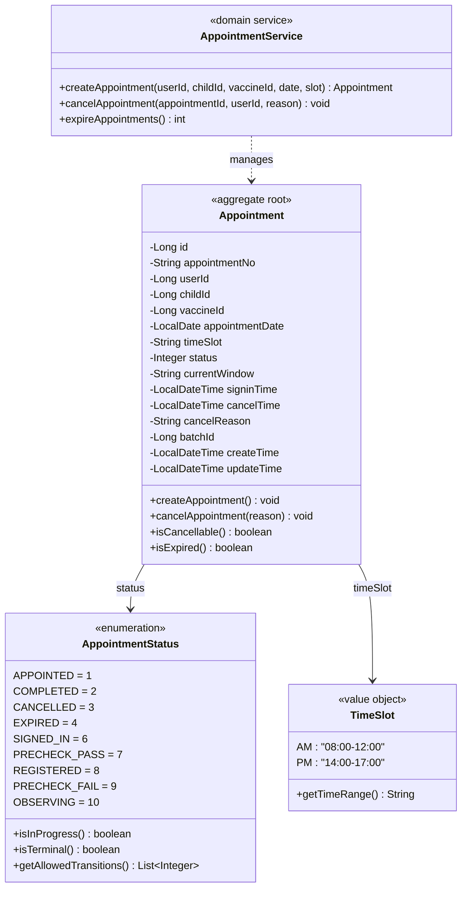
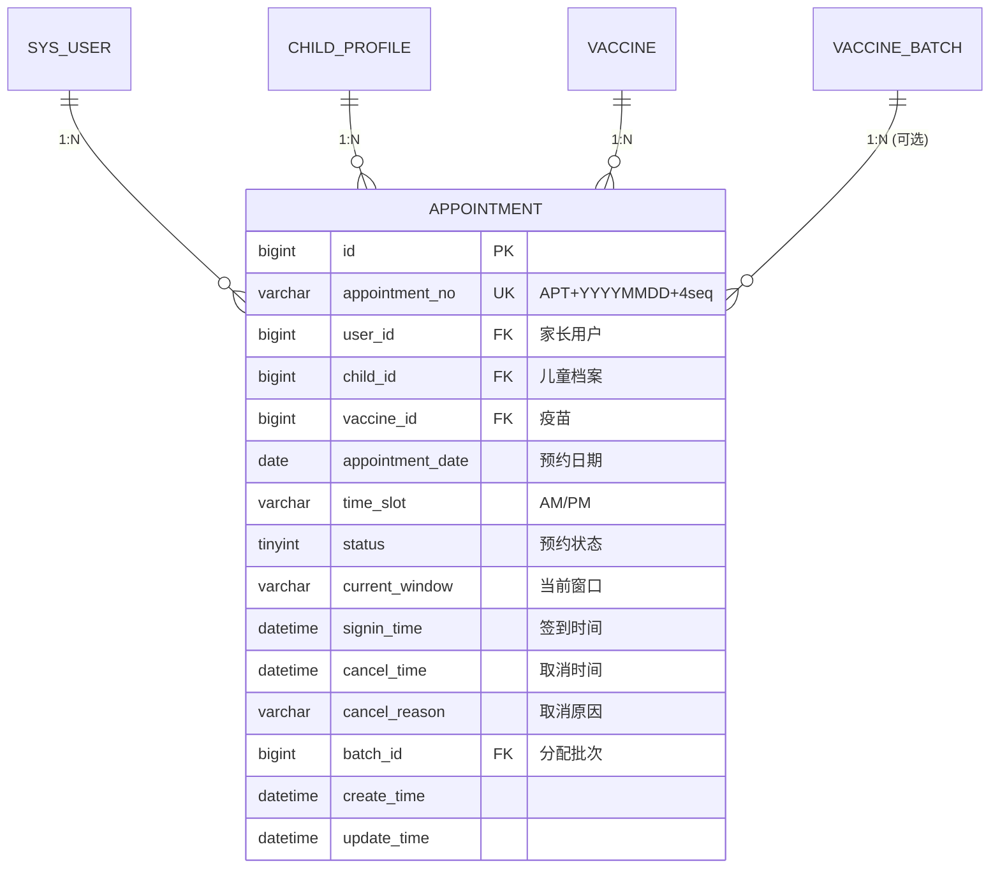

# 疫苗管理系统 — 预约上下文领域模型

**文档编号:** DOMAIN-APPOINTMENT-001
**版本:** V1.1
**状态:** 正式发布
**日期:** 2026-04-02
**上游依赖:** REQ-APPOINTMENT V1.0 / REQ-GLOBAL V1.0

---

## 目录

1. [上下文概述](#1-上下文概述)
2. [聚合设计](#2-聚合设计)
3. [实体详细定义](#3-实体详细定义)
4. [值对象定义](#4-值对象定义)
5. [领域服务](#5-领域服务)
6. [领域事件](#6-领域事件)
7. [仓储接口](#7-仓储接口)
8. [物理数据模型](#8-物理数据模型)
9. [与其他上下文的关系](#9-与其他上下文的关系)

---

## 1. 上下文概述

### 1.1 核心定位

Appointment Context 是系统的**主控上下文**，所有业务流程围绕预约记录展开。预约状态（`status`）是驱动整个系统流转的唯一控制变量。

### 1.2 职责边界

| 职责 | 本上下文 | 其他上下文 |
|------|---------|-----------|
| 创建预约（status=1） | **负责** | — |
| 取消预约（status=3） | **负责** | — |
| 过期处理（status=4） | **负责** | — |
| 签到（status=6） | — | Flow Context |
| 预检（status=7/9） | — | Flow Context |
| 登记（status=8） | — | Register Context |
| 接种（status=10） | — | Vaccinate Context |
| 留观结束（status=2） | — | Observe Context |

### 1.3 本上下文约束

- 本上下文只写入 `status = 1, 3, 4` 三种状态
- 其他状态由对应执行上下文写入，本上下文只读
- `batch_id` 由 Register Context 写入，本上下文只读
- `current_window` 由各执行模块写入，本上下文不修改

---

## 2. 聚合设计

### 2.1 聚合边界



### 2.2 聚合说明

| 项目 | 说明 |
|------|------|
| 聚合根 | `Appointment` |
| 聚合内实体 | 无（Appointment 是唯一实体） |
| 聚合标识符 | `appointment.id` |
| 不变量 | 同一用户+同一儿童+同一疫苗，同时只能有一个进行中的预约 |
| 并发控制 | 创建时 `SELECT FOR UPDATE` 时段容量校验 |

---

## 3. 实体详细定义

### 3.1 Appointment（预约）

| 字段 | 类型 | 约束 | 说明 |
|------|------|------|------|
| id | bigint | PK, auto_increment | 预约ID |
| appointment_no | varchar(20) | UNIQUE, NOT NULL | 预约编号，格式：APT + YYYYMMDD + 4位日序号 |
| user_id | bigint | NOT NULL, FK → sys_user.id | 家长用户ID |
| child_id | bigint | NOT NULL, FK → child_profile.id | 儿童档案ID |
| vaccine_id | bigint | NOT NULL, FK → vaccine.id | 疫苗ID |
| appointment_date | date | NOT NULL | 预约日期 |
| time_slot | varchar(10) | NOT NULL | 预约时段：AM/PM |
| status | tinyint | NOT NULL, DEFAULT 1 | 预约状态（见值对象定义） |
| current_window | varchar(50) | NULL | 当前所在窗口编码 |
| signin_time | datetime | NULL | 签到时间 |
| cancel_time | datetime | NULL | 取消时间 |
| cancel_reason | varchar(500) | NULL | 取消原因 |
| batch_id | bigint | NULL, FK → vaccine_batch.id | 分配的批次ID（由Register写入） |
| create_time | datetime | NOT NULL, DEFAULT CURRENT_TIMESTAMP | 创建时间 |
| update_time | datetime | NOT NULL, DEFAULT CURRENT_TIMESTAMP ON UPDATE | 更新时间 |

### 3.2 字段业务规则

| 字段 | 业务规则 |
|------|---------|
| appointment_no | 格式：`APT` + `YYYYMMDD` + 4位日序号（如 APT202604020001），日序号每日重置 |
| appointment_date | 必须 > CURDATE()，且在排班可预约天数范围内 |
| time_slot | 仅允许 AM 或 PM |
| status | 创建时默认为 1（已预约），本上下文只能设置为 1/3/4 |
| current_window | 创建时为 NULL，由各执行模块写入 |
| batch_id | 创建时为 NULL，由 Register Context 在登记时写入 |

---

## 4. 值对象定义

### 4.1 AppointmentStatus（预约状态）

```java
public enum AppointmentStatus {
    APPOINTED(1, "已预约", false),
    COMPLETED(2, "已完成", true),
    CANCELLED(3, "已取消", true),
    EXPIRED(4, "已过期", true),
    SIGNED_IN(6, "已签到", false),
    PRECHECK_PASS(7, "预检通过", false),
    REGISTERED(8, "已登记", false),
    PRECHECK_FAIL(9, "预检失败", true),
    OBSERVING(10, "留观中", false);

    private final int code;
    private final String description;
    private final boolean terminal;

    public boolean isTerminal() { return terminal; }
    public boolean isInProgress() { return !terminal; }

    public static AppointmentStatus fromCode(int code) {
        return Arrays.stream(values())
            .filter(s -> s.code == code)
            .findFirst()
            .orElseThrow(() -> new BusinessException(1007, "未知的预约状态"));
    }
}
```

| 状态码 | 枚举名 | 描述 | 是否终态 |
|--------|--------|------|---------|
| 1 | APPOINTED | 已预约 | 否 |
| 2 | COMPLETED | 已完成 | 是 |
| 3 | CANCELLED | 已取消 | 是 |
| 4 | EXPIRED | 已过期 | 是 |
| 6 | SIGNED_IN | 已签到 | 否 |
| 7 | PRECHECK_PASS | 预检通过 | 否 |
| 8 | REGISTERED | 已登记 | 否 |
| 9 | PRECHECK_FAIL | 预检失败 | 是 |
| 10 | OBSERVING | 留观中 | 否 |

### 4.2 TimeSlot（预约时段）

| 编码 | 时间范围 | 说明 |
|------|---------|------|
| AM | 08:00 - 12:00 | 上午场 |
| PM | 14:00 - 17:00 | 下午场 |

---

## 5. 领域服务

> **分层说明：** 以下方法标注为"领域服务"，但其中 `createAppointment` 和 `cancelAppointment` 包含跨上下文协调逻辑（调用 Identity/Stock 服务）。在实际代码实现中，这些跨上下文调用应由 Application Service 编排，领域服务仅负责本聚合内的业务规则校验和状态变更。此处为简化文档呈现，将编排逻辑与领域逻辑合并展示。

### 5.1 AppointmentService

#### 5.1.1 createAppointment — 创建预约

```java
/**
 * 创建预约
 *
 * 前置校验：
 * 0. 用户状态有效（status != DISABLED/CANCELLED）
 * 1. 用户未冻结（checkNoShowFreeze → Identity Context）
 * 2. 儿童档案存在且属于当前用户
 * 3. 疫苗已上架
 * 4. 预约日期有效（> CURDATE()，在排班范围内）
 * 5. 时段未满员（并发安全）
 * 6. 无重复进行中预约（同用户+同儿童+同疫苗）
 */
@Transactional(rollbackFor = Exception.class, timeout = 30)
public Appointment createAppointment(Long userId, Long childId,
                                      Long vaccineId, LocalDate date,
                                      String timeSlot) {
    // 0. 用户状态校验（前置条件）
    User user = userRepository.findById(userId)
        .orElseThrow(() -> new BusinessException(7003, "用户不存在"));
    if (user.getStatus() == UserStatus.DISABLED.getCode()) {
        throw new BusinessException(1011, "用户已被冻结，无法预约");
    }
    if (user.getStatus() == UserStatus.CANCELLED.getCode()) {
        throw new BusinessException(7003, "用户已注销，无法预约");
    }

    // 1. 用户冻结校验（调用 Identity Context）
    FreezeCheckResult freezeCheck = identityService.checkNoShowFreeze(userId);
    if (freezeCheck.isFrozen()) {
        throw new BusinessException(1012, "爽约冻结中，冻结至" + freezeCheck.getFreezeEndTime());
    }

    // 2. 儿童档案校验
    ChildProfile child = childProfileRepository.findById(childId)
        .filter(c -> c.getParentId().equals(userId))
        .orElseThrow(() -> new BusinessException(2001, "儿童档案不存在或不属于当前用户"));

    // 3. 疫苗上架校验
    vaccineRepository.findById(vaccineId)
        .filter(v -> v.isOnShelf())
        .orElseThrow(() -> new BusinessException(2003, "疫苗未上架"));

    // 4. 日期有效性校验
    if (!date.isAfter(LocalDate.now())) {
        throw new BusinessException(2004, "预约日期无效");
    }

    // 5. 重复预约校验
    boolean hasDuplicate = appointmentRepository
        .findInProgressByUserAndChild(userId, childId, vaccineId).isPresent();
    if (hasDuplicate) {
        throw new BusinessException(2006, "同日同疫苗已存在进行中的预约");
    }

    // 6. 时段容量校验（SELECT FOR UPDATE 并发安全）
    int currentCount = appointmentRepository.countBySlotForUpdate(vaccineId, date, timeSlot);
    int maxCapacity = configService.getInt("appointment.max_capacity", 50);
    if (currentCount >= maxCapacity) {
        throw new BusinessException(2005, "预约时段已满");
    }

    // 7. 生成预约编号
    String appointmentNo = generateAppointmentNo(date);

    // 8. 创建预约
    Appointment appointment = new Appointment();
    appointment.setAppointmentNo(appointmentNo);
    appointment.setUserId(userId);
    appointment.setChildId(childId);
    appointment.setVaccineId(vaccineId);
    appointment.setAppointmentDate(date);
    appointment.setTimeSlot(timeSlot);
    appointment.setStatus(AppointmentStatus.APPOINTED.getCode());
    appointment.setCurrentWindow(null);

    appointmentRepository.save(appointment);

    // 9. 发布领域事件
    eventBus.publish(new AppointmentCreatedEvent(
        appointment.getId(), userId, vaccineId, date, timeSlot));

    return appointment;
}
```

#### 5.1.2 cancelAppointment — 取消预约

```java
/**
 * 取消预约
 *
 * 业务规则：
 * 1. 只有 status=1（已预约）可以取消
 * 2. 取消时间 >= 预约日期 → 计入爽约（no_show_count += 1）
 * 3. no_show_count >= 3 → 冻结7天
 * 4. 如已分配批次（batch_id不为NULL），需释放锁定库存
 */
@Transactional(rollbackFor = Exception.class, timeout = 30)
public void cancelAppointment(Long appointmentId, Long userId, String reason) {
    // 1. 加行锁查询
    Appointment appointment = appointmentRepository.findByIdForUpdate(appointmentId);
    if (appointment == null) {
        throw new BusinessException(2008, "预约不存在");
    }

    // 2. 归属校验
    if (!appointment.getUserId().equals(userId)) {
        throw new BusinessException(1002, "无权操作该预约");
    }

    // 3. 状态校验
    if (appointment.getStatus() != AppointmentStatus.APPOINTED.getCode()) {
        throw new BusinessException(2007, "当前状态不允许取消");
    }

    // 4. 执行取消
    LocalDateTime cancelTime = LocalDateTime.now();
    appointment.setStatus(AppointmentStatus.CANCELLED.getCode());
    appointment.setCancelTime(cancelTime);
    appointment.setCancelReason(reason);
    appointment.setCurrentWindow(null);
    appointmentRepository.updateStatus(appointment);

    // 5. 爽约判定
    if (!cancelTime.toLocalDate().isBefore(appointment.getAppointmentDate())) {
        // cancel_time >= appointment_date → 计入爽约
        userService.incrementNoShowCount(userId);

        // 检查是否需要冻结
        int newCount = userService.getNoShowCount(userId);
        int threshold = configService.getInt("no_show.freeze_threshold", 3);
        if (newCount >= threshold) {
            int freezeDays = configService.getInt("no_show.freeze_days", 7);
            userService.freezeForNoShow(userId, freezeDays);
        }
    }

    // 6. 释放锁定库存（如有）
    // 注意：当前状态机仅允许 status=1 取消，此时 batchId 为 NULL（batchId 在登记 status=8 时写入）。
    // 此处为防御性编程，为未来扩展"已登记后取消"场景预留。
    if (appointment.getBatchId() != null) {
        stockService.releaseStock(appointment.getBatchId());
    }

    // 7. 发布领域事件
    eventBus.publish(new AppointmentCancelledEvent(appointmentId, appointment.getBatchId()));
}
```

#### 5.1.3 expireAppointments — 过期处理定时任务

```java
/**
 * 过期处理定时任务
 * Cron: 0 30 0 * * ?（每天00:30执行）
 *
 * 业务规则：
 * 1. 将 status=1 且 appointment_date < CURDATE() 的预约标记为过期
 * 2. 系统过期不计入爽约
 */
@Transactional(rollbackFor = Exception.class, timeout = 60)
public int expireAppointments() {
    List<Appointment> expiredList = appointmentRepository.findExpired(LocalDate.now());
    int count = 0;
    for (Appointment appointment : expiredList) {
        appointment.setStatus(AppointmentStatus.EXPIRED.getCode());
        appointment.setCurrentWindow(null);
        appointmentRepository.updateStatus(appointment);
        count++;

        eventBus.publish(new AppointmentExpiredEvent(appointment.getId()));
    }
    return count;
}
```

---

## 6. 领域事件

### 6.1 事件清单

| 事件名 | 触发时机 | 携带数据 | 消费者 |
|--------|---------|---------|--------|
| `AppointmentCreatedEvent` | 预约创建成功 | appointmentId, userId, vaccineId, appointmentDate, timeSlot | — |
| `AppointmentCancelledEvent` | 预约取消 | appointmentId, batchId | Stock Context（释放锁定库存） |
| `AppointmentExpiredEvent` | 预约过期 | appointmentId | — |

### 6.2 事件定义

```java
public record AppointmentCreatedEvent(
    Long appointmentId, Long userId, Long vaccineId,
    LocalDate appointmentDate, String timeSlot
) {}

public record AppointmentCancelledEvent(
    Long appointmentId, Long batchId
) {}

public record AppointmentExpiredEvent(
    Long appointmentId
) {}
```

---

## 7. 仓储接口

```java
public interface AppointmentRepository {

    /** 根据ID查询 */
    Appointment findById(Long id);

    /** 加行锁查询（用于并发控制） */
    Appointment findByIdForUpdate(Long id);

    /** 保存预约 */
    void save(Appointment appointment);

    /** 更新状态 */
    void updateStatus(Appointment appointment);

    /**
     * 时段容量统计（加锁，用于并发控制）
     * 统计 status IN (1,6,7,8,10) 的预约数
     */
    int countBySlotForUpdate(Long vaccineId, LocalDate date, String timeSlot);

    /** 查询用户是否有进行中的重复预约 */
    Optional<Appointment> findInProgressByUserAndChild(
        Long userId, Long childId, Long vaccineId);

    /** 查询过期的预约 */
    List<Appointment> findExpired(LocalDate beforeDate);

    /** 分页查询用户预约列表 */
    Page<Appointment> findByUserId(Long userId, Pageable pageable);

    /** 生成预约编号 */
    String generateAppointmentNo(LocalDate date);
}
```

---

## 8. 物理数据模型

### 8.1 ER 关系图



### 8.2 DDL

```sql
-- ============================================================
-- 预约表
-- 所属上下文: Appointment Context
-- ============================================================
CREATE TABLE `appointment` (
    `id`                  BIGINT       NOT NULL AUTO_INCREMENT COMMENT '预约ID',
    `appointment_no`      VARCHAR(20)  NOT NULL                COMMENT '预约编号（APT+YYYYMMDD+4seq）',
    `user_id`             BIGINT       NOT NULL                COMMENT '家长用户ID',
    `child_id`            BIGINT       NOT NULL                COMMENT '儿童档案ID',
    `vaccine_id`          BIGINT       NOT NULL                COMMENT '疫苗ID',
    `appointment_date`    DATE         NOT NULL                COMMENT '预约日期',
    `time_slot`           VARCHAR(10)  NOT NULL                COMMENT '预约时段（AM/PM）',
    `status`              TINYINT      NOT NULL DEFAULT 1      COMMENT '预约状态（1已预约/2已完成/3已取消/4已过期/6已签到/7预检通过/8已登记/9预检失败/10留观中）',
    `current_window`      VARCHAR(50)  NULL                    COMMENT '当前所在窗口编码',
    `signin_time`         DATETIME     NULL                    COMMENT '签到时间',
    `cancel_time`         DATETIME     NULL                    COMMENT '取消时间',
    `cancel_reason`       VARCHAR(500) NULL                    COMMENT '取消原因',
    `batch_id`            BIGINT       NULL                    COMMENT '分配的批次ID（登记时写入）',
    `create_time`         DATETIME     NOT NULL DEFAULT CURRENT_TIMESTAMP COMMENT '创建时间',
    `update_time`         DATETIME     NOT NULL DEFAULT CURRENT_TIMESTAMP ON UPDATE CURRENT_TIMESTAMP COMMENT '更新时间',
    PRIMARY KEY (`id`),
    UNIQUE KEY `uk_appointment_no` (`appointment_no`),
    KEY `idx_user_id` (`user_id`),
    KEY `idx_child_id` (`child_id`),
    KEY `idx_vaccine_id` (`vaccine_id`),
    KEY `idx_appointment_date` (`appointment_date`),
    KEY `idx_status` (`status`),
    KEY `idx_date_slot_status` (`vaccine_id`, `appointment_date`, `time_slot`, `status`),
    KEY `idx_batch_id` (`batch_id`),
    KEY `idx_create_time` (`create_time`)
) ENGINE=InnoDB DEFAULT CHARSET=utf8mb4 COLLATE=utf8mb4_general_ci COMMENT='预约接种表';
```

---

## 9. 与其他上下文的关系

### 9.1 外部写入 appointment 表的规则

| 写入操作 | 执行上下文 | 写入字段 | 前置状态 | 目标状态 |
|---------|-----------|---------|---------|---------|
| 创建预约 | Appointment | 全部字段（batch_id=NULL） | — | 1 |
| 取消预约 | Appointment | status, cancel_time, cancel_reason, current_window | 1 | 3 |
| 过期处理 | Appointment | status, current_window | 1 | 4 |
| 签到 | Flow | status, current_window, signin_time | 1 | 6 |
| 预检通过 | Flow | status, current_window | 6 | 7 |
| 预检失败 | Flow | status, current_window | 6 | 9 |
| 登记 | Register | status, batch_id, current_window | 7 | 8 |
| 接种 | Vaccinate | status, current_window | 8 | 10 |
| 留观结束 | Observe | status, current_window | 10 | 2 |

### 9.2 依赖的外部上下文

| 依赖 | 交互方式 | 用途 |
|------|---------|------|
| Identity Context | Application Service | 创建预约前检查用户冻结状态 |
| Identity Context | Repository（只读） | 查询儿童档案信息 |
| Stock Context | 领域事件 | 取消预约时释放锁定库存 |
| Stock Context | Repository（只读） | 查询疫苗上架状态 |

---

## 版本历史

| 版本 | 日期 | 变更说明 |
|------|------|----------|
| V1.0 | 2026-04-02 | 初始版本，基于 REQ-APPOINTMENT V1.0 生成 |
| V1.1 | 2026-04-03 | REQ-DOMAIN 一致性评审修复（P1：createAppointment 补充用户状态校验） |

---

**文档结束**
