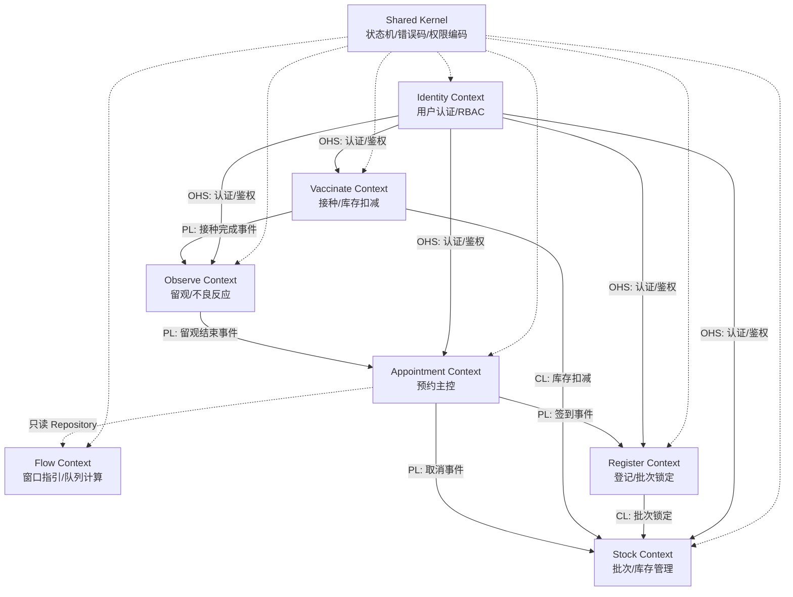
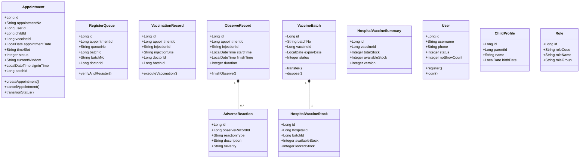

# 疫苗管理系统 — 领域模型总览

**文档编号:** DOMAIN-OVERVIEW-001
**版本:** V1.1
**状态:** 正式发布
**日期:** 2026-04-03
**上游依赖:** REQ-GLOBAL V1.0 / 全部 REQ 模块文档

---

## 目录

1. [设计原则](#1-设计原则)
2. [限界上下文划分](#2-限界上下文划分)
3. [上下文映射](#3-上下文映射)
4. [聚合总览](#4-聚合总览)
5. [领域事件总览](#5-领域事件总览)
6. [文档索引](#6-文档索引)

---

## 1. 设计原则

| 原则 | 说明 |
|------|------|
| **预约主控** | Appointment 是系统核心聚合，所有业务流程围绕预约记录展开 |
| **状态机驱动** | 预约状态是流程唯一控制变量，任何环节必须校验当前状态 |
| **聚合间通过事件通信** | 跨聚合状态变更通过领域事件解耦，不直接调用其他聚合的修改方法 |
| **共享内核最小化** | Shared Kernel 仅包含枚举定义和常量，不包含业务逻辑 |
| **读写分离** | Flow Context 为纯查询服务，不持有任何聚合根 |
| **库存双阶段** | 登记时锁定（locked_stock+1），接种时扣减（available_stock-1, locked_stock-1） |

---

## 2. 限界上下文划分

### 2.1 上下文清单

| 限界上下文 | 对应REQ模块 | 聚合根 | 核心职责 | 详细文档 |
|-----------|------------|--------|---------|---------|
| **Appointment Context** | REQ-APPOINTMENT | `Appointment` | 预约创建、取消、过期、状态机驱动 | [预约上下文](预约上下文.md) |
| **Flow Context** | REQ-FLOW | 无（纯查询服务） | 窗口指引、队列计算 | [流程指引上下文](流程指引上下文.md) |
| **Register Context** | REQ-REGISTER | `RegisterQueue` | 登记核实、FEFO批次锁定、排队管理 | [登记上下文](登记上下文.md) |
| **Vaccinate Context** | REQ-VACCINATE | `VaccinationRecord` | 接种执行、库存扣减、注射号生成 | [接种上下文](接种上下文.md) |
| **Observe Context** | REQ-FLOW(留观) | `ObserveRecord` | 留观监测、预检评估、不良反应处理、留观结束 | [留观上下文](留观上下文.md) |
| **Stock Context** | REQ-STOCK | `VaccineBatch`, `HospitalVaccineSummary` | 批次管理、库存调拨、销毁、预警 | [库存上下文](库存上下文.md) |
| **Identity Context** | REQ-USER + REQ-ADMIN | `User`, `ChildProfile`, `Role` | 用户认证、RBAC权限、儿童档案 | [身份认证上下文](身份认证上下文.md) |
| **Shared Kernel** | REQ-GLOBAL | 无（共享代码包） | 状态枚举、错误码、权限编码 | [共享内核](共享内核.md) |

### 2.2 上下文关系图

### 2.3 上下文关系说明

| 关系类型 | 上游 → 下游 | 交互方式 | 说明 |
|---------|-----------|---------|------|
| **Shared Kernel** | Shared Kernel → 所有 | 共享代码包 | 状态枚举、错误码常量、权限编码 |
| **OHS**（开放主机服务） | Identity → 所有 | Application Service | 认证/鉴权是所有操作的入口守卫 |
| **只读引用** | Flow → Appointment | 只读 Repository | Flow 实时查询预约状态计算指引，不订阅事件 |
| **PL** | Appointment → Register | 领域事件 | 签到后 Register 可查询待登记队列 |
| **CL**（防腐层） | Register → Stock | Application Service | FEFO批次锁定，通过应用层编排 |
| **CL** | Vaccinate → Stock | Application Service | 库存扣减，通过应用层编排 |
| **PL** | Vaccinate → Observe | 领域事件 | 接种完成后触发留观计时 |
| **PL** | Appointment → Stock | 领域事件 | 取消预约时释放锁定库存 |
| **PL** | Observe → Appointment | 领域事件 | 留观结束后更新预约为已完成 |

---

## 3. 上下文映射

### 3.1 跨上下文事务处理

| 事务编号 | 涉及上下文 | 协调方式 | 说明 |
|---------|-----------|---------|------|
| T2 | Appointment + Stock | 领域事件 | 取消预约后发布事件，Stock监听释放锁定库存 |
| T4 | Appointment + Observe | Saga（应用层编排） | 预检评估，ObserveAppService 编排预约状态+预检记录 |
| T5 | Register + Stock | Saga（应用层编排） | Register先调用Stock锁定，成功后确认登记 |
| T6 | Vaccinate + Stock | Saga（应用层编排） | Vaccinate先调用Stock扣减，成功后确认接种 |
| T7 | Observe + Appointment | Saga（应用层编排） | 留观结束后更新预约状态为已完成 |
| T8 | Stock（内部） | 同一上下文事务 | 调拨操作在同一事务内完成 |
| T9 | Stock（内部） | 同一上下文事务 | 销毁操作在同一事务内完成 |
| T10 | Identity（内部） | 同一上下文事务 | 角色权限分配，级联更新用户角色和角色权限 |

### 3.2 跨上下文数据访问规则

| 数据 | 所属上下文 | 其他上下文访问方式 |
|------|-----------|-----------------|
| `appointment.status` | Appointment | 所有上下文只读 |
| `appointment.current_window` | Appointment | Flow 只读，各执行模块写入 |
| `appointment.batch_id` | Appointment | Register/Vaccinate 通过应用层写入 |
| `hospital_vaccine_stock` | Stock | Register/Vaccinate 通过防腐层写入 |
| `sys_user` / `sys_role` | Identity | 所有上下文通过 OHS 只读 |
| `vaccine_batch` | Stock | Register/Vaccinate 通过防腐层只读 |
| `child_profile` | Identity | Appointment 只读 |

---

## 4. 聚合总览

### 4.1 聚合边界规则

| 聚合根 | 聚合内实体 | 聚合外访问方式 |
|--------|-----------|--------------|
| `Appointment` | 无 | 通过 ID 引用其他聚合根 |
| `RegisterQueue` | 无 | 持有 `appointmentId`（外键引用，非聚合内导航） |
| `VaccinationRecord` | 无 | 持有 `appointmentId`、`batchId` |
| `ObserveRecord` | `AdverseReaction` | 持有 `appointmentId`、`injectionId` |
| `VaccineBatch` | `HospitalVaccineStock` | 持有 `vaccineId` |
| `HospitalVaccineSummary` | 无（独立聚合） | 持有 `vaccineId` |
| `User` | 无 | — |
| `ChildProfile` | 无（独立聚合） | 持有 `parentId`（外键引用） |
| `Role` | 无 | — |

---

## 5. 领域事件总览

| 事件名 | 发布上下文 | 消费上下文 | 触发时机 | 携带数据 |
|--------|-----------|-----------|---------|---------|
| `AppointmentCreated` | Appointment | — | 预约创建成功 | appointmentId, userId, vaccineId, date |
| `AppointmentCancelled` | Appointment | Stock | 用户取消预约 | appointmentId, batchId |
| `AppointmentExpired` | Appointment | — | 定时任务标记过期 | appointmentId |
| `AppointmentSignedIn` | Appointment | — | 签到完成 | appointmentId, userId |
| `Registered` | Register | — | 登记完成 | appointmentId, batchId, queueNo |
| `BatchSwitched` | Register | — | 批次切换 | appointmentId, oldBatchId, newBatchId |
| `VaccinationExecuted` | Vaccinate | Observe | 接种完成 | appointmentId, injectionId |
| `ObservationFinished` | Observe | Appointment | 留观结束 | appointmentId |
| `AdverseReactionReported` | Observe | — | 不良反应上报 | appointmentId, reactionType |
| `StockTransferred` | Stock | — | 库存调拨 | batchId, quantity, from/to |
| `BatchDisposed` | Stock | — | 批次销毁 | batchId, quantity |
| `StockAlertTriggered` | Stock | — | 库存预警 | vaccineId, batchId, alertType |
| `BatchStatusChanged` | Stock | — | 批次状态变更 | batchId, oldStatus, newStatus |
| `UserRegistered` | Identity | — | 用户注册 | userId, phone |
| `UserFrozen` | Identity | — | 用户冻结 | userId, reason |
| `UserUnfrozen` | Identity | — | 用户解冻 | userId |
| `RoleAssigned` | Identity | — | 角色分配 | userId, roleId |
| `PermissionChanged` | Identity | — | 权限变更 | roleId, permissionCodes |

---

## 6. 文档索引

| 文档 | 路径 | 内容 |
|------|------|------|
| 领域模型总览 | [领域模型总览.md](领域模型总览.md) | 限界上下文、聚合关系、上下文映射、事件总览 |
| 预约上下文 | [预约上下文.md](预约上下文.md) | Appointment聚合、物理表DDL |
| 流程指引上下文 | [流程指引上下文.md](流程指引上下文.md) | FlowGuideService、队列计算 |
| 登记上下文 | [登记上下文.md](登记上下文.md) | RegisterQueue聚合、FEFO、物理表DDL |
| 接种上下文 | [接种上下文.md](接种上下文.md) | VaccinationRecord聚合、物理表DDL |
| 留观上下文 | [留观上下文.md](留观上下文.md) | ObserveRecord聚合、预检评估、不良反应、物理表DDL |
| 库存上下文 | [库存上下文.md](库存上下文.md) | VaccineBatch聚合、调拨/销毁、物理表DDL |
| 身份认证上下文 | [身份认证上下文.md](身份认证上下文.md) | User/ChildProfile/Role聚合、RBAC、物理表DDL |
| 应用层设计 | [应用层设计.md](应用层设计.md) | 用例编排、应用服务接口、DTO |
| 共享内核 | [共享内核.md](共享内核.md) | 统一错误码、权限模型、状态机共享内核 |

---

## 版本历史

| 版本 | 日期 | 变更说明 |
|------|------|----------|
| V1.0 | 2026-04-02 | 初始版本，基于全部REQ文档生成 |
| V1.1 | 2026-04-03 | REQ-DOMAIN 一致性评审修复（补充 T4/T10 事务、Observe 职责更新、链接更新为中文文件名） |

---

**文档结束**
